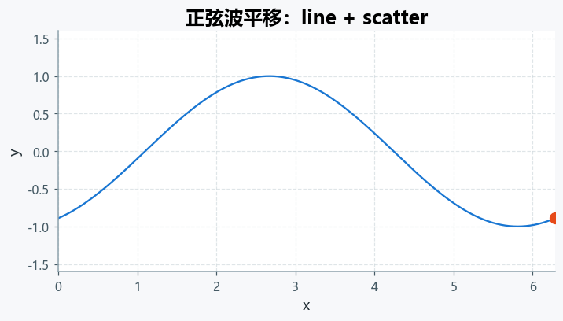
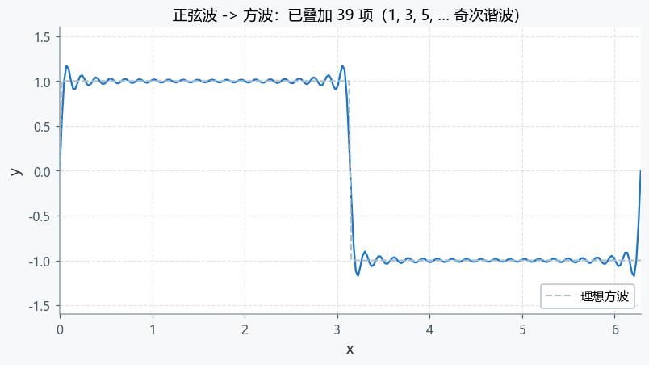

# 动画：AnimationPlotter

本文档只讲动画。静态图层的方法与参数见 [API.md](API.md)。

`AnimationPlotter` 继承自 `MultiPlotter`，在它之上增加 `animate()`：

~~~python
from multiplotter import AnimationPlotter
~~~

整个流程只有三步：

~~~text
① 添加图层（和静态图完全一样，但必须固定坐标轴范围）
② draw(show=False)                        -> 得到固定的 Figure / Axes
③ animate(frames=..., update_func=...)    -> 生成动画，可保存 GIF / MP4 / HTML
~~~

> 动画必须固定坐标轴范围，否则每帧自动缩放会让画面抖动。
> 用 `view={"xlim": ..., "ylim": ...}`，或在 `animate()` 里传 `xlim` / `ylim`，
> 或传 `allow_auto_limits=True` 用当前范围兜底。

相关文档：

- 静态图层参数：[API.md](API.md)
- 扩展自定义图层的动画：[EXTENDING.md](EXTENDING.md)
- 动画报错排查：[FAQ.md](FAQ.md)

## 25. 动画：AnimationPlotter

`AnimationPlotter` 继承自 `MultiPlotter`，在保留全部静态绘图能力的同时增加了动画功能。

~~~python
from Multiplotter import AnimationPlotter

plotter = AnimationPlotter(
    ncols=2,
    figsize_per_plot=(6, 4),
    dpi=120,
)
~~~

构造参数与 `MultiPlotter` 完全一致（`ncols`、`figsize_per_plot`、`dpi`）。

### 25.1 工作流程

动画分三步，顺序不能颠倒：

~~~text
1. 添加图层     plotter.add_plot(...) / add_surface(...) ...
2. 画静态底图   plotter.draw(show=False)
3. 生成动画     plotter.animate(...)
~~~

也就是说：**先画一张静态图，再让它在时间轴上动起来**。

### 25.2 坐标轴范围必须固定

这是 `AnimationPlotter` 最重要的一条规则。

动画每一帧都会重绘数据，如果坐标轴范围没有写死，Matplotlib 会在每帧自动重新缩放，
画面就会不停抖动。所以 `animate()` 会先检查每个动画子图是否固定了范围：

- 二维子图必须固定 `xlim` 和 `ylim`；
- 三维子图必须固定 `xlim`、`ylim` 和 `zlim`。

判断依据是添加图层时 `view` 字典里是否**显式写了**这些键。没有写就直接抛错：

~~~python
plotter = AnimationPlotter(ncols=1, figsize_per_plot=(6, 4))
plotter.add_plot(kind="line", x=x, y=y, subplot=0)   # 没有 view
plotter.draw(show=False)
plotter.animate(frames=30, update_func=update)
~~~

~~~text
ValueError: 做动画前必须固定坐标轴范围，否则每帧会自动缩放，画面会抖动。
问题子图：
  - subplot=0（2维）缺少 xlim、ylim

解决办法（任选其一）：
  1) 在添加图层时用 view 固定范围：
     plotter.add_plot(..., view={"xlim": (0, 10), "ylim": (-2, 2)})
  2) 调用 animate(..., xlim=(0, 10), ylim=(-2, 2)) 显式给出范围；
  3) 调用 animate(..., allow_auto_limits=True)，用绘制完成时的当前范围兜底。
~~~

三种解决办法：

~~~python
# 办法 1：在 view 里固定（推荐，静态图也受益）
plotter.add_plot(kind="line", x=x, y=y, subplot=0,
                 view={"xlim": (0, 2*np.pi), "ylim": (-1.6, 1.6)})

# 办法 2：在 animate() 里补上
plotter.animate(..., xlim=(0, 2*np.pi), ylim=(-1.6, 1.6))

# 办法 3：用绘制完成时的当前范围兜底（不报错，但范围不由你控制）
plotter.animate(..., allow_auto_limits=True)
~~~

`allow_auto_limits=True` 时，三维子图还会顺带固定 `elev` / `azim`，
避免每帧重绘时视角复位。

### 25.3 三种帧更新模式（update_mode）

| `update_mode` | 每帧做什么 | 速度 | 适用场景 |
| --- | --- | --- | --- |
| `"reset"`（默认） | 先 `ax.clear()`，再让回调重画这一帧 | 中等 | 通用，任何图类型都能画 |
| `"artists"` | 不清空，回调里用 `set_data()` 等原地更新已有对象 | 最快 | 折线/散点/热力图等固定对象的动画，可配 `blit=True` |
| `"append"` | 不清空，把回调新画的对象累积到画布上 | 中等 | 轨迹、粒子、覆盖层 |

#### `reset` 模式必须重画，而不是「只改一点」

`update_mode="reset"` 的语义是：**先清空坐标轴，再由回调从头画一遍**。
所以下面这种「只想改个视角」的写法一定会出问题：

~~~python
plotter.animate(subplots=[0], update_mode="reset", update_func=update)

def update(ax, frame):
    ax.view_init(elev=22, azim=-60 + frame * 18)   # 错：内容已经被 clear 掉了
    return ax,
~~~

结果就是：坐标轴网格还在（那是 `view_init` 和 `grid` 画的），
**但箭头、流线、曲面这些内容全都不见了**。三维动画里最容易这样翻车，
因为「转视角」看起来像是只改了一个参数。

正确写法是把内容一起重画：

~~~python
quiver_data = MultiPlotter._shrink_field(X, Y, Z, U, V, W, density=10)

def update(ax, frame):
    angle = -60 + frame * 18

    ax.clear()                                    # 框架已经 clear，这里再写一次更直观
    ax.quiver(*quiver_data, ...)                  # 重画箭头
    for trajectory in streams:
        ax.plot(trajectory[:, 0], trajectory[:, 1], trajectory[:, 2],
                color="#E64A19", linewidth=2.6, zorder=100)   # 重画流线

    ax.set_xlim(-2, 2); ax.set_ylim(-2, 2); ax.set_zlim(-1.5, 1.5)
    ax.view_init(elev=22, azim=angle)
    return ax,
~~~

两点提醒：

- 箭头数量多时先按 `density` 抽稀（用 `MultiPlotter._shrink_field()`），
  否则几千支箭头会把流线完全埋掉；
- 流线用更大的 `zorder` 画，才不会被箭头盖住。

#### 多子图动画：回调会被逐个调用，每个子图都要重画

`subplots` 里写了几个子图，**每一帧 `update` 就会被调用几次**：
框架先把当前子图 `ax.clear()`（`reset` 模式），再用这个子图的 `ax` 调用 `update`。
所以：

- 回调必须靠 `ax is xxx_ax` 区分，重画当前传进来的**那个** `ax`；
- 只重画其中一个子图，另一个就会一直停在 `draw()` 时的第一帧。

第二种情况最隐蔽：它**不是空白图，而是一张不动的图**。
比如「左图箭头 + 右图流线」时只重画了箭头，右图就会始终显示初始时刻的流线，
看起来像"流线不随时间变化"——很容易误判成物理或数据的问题。

典型错误（右图流线永远停在第一帧）：

~~~python
plotter.animate(subplots=[0, 1], update_mode="reset", update_func=update)

def update(ax, frame):          # 错：只处理了子图 0
    ax.quiver(X, Y, qu, qv, speed)     # 箭头会动
    # 子图 1 从头到尾没被重画 -> 流线一直停在 draw() 的那一帧
    return ax,
~~~

正确写法——按 `ax` 区分，每个子图都重画：

~~~python
quiver_ax = plotter.get_axes(0)

def update(ax, frame):
    qu, qv = rotate(frame)

    if ax is quiver_ax:
        ax.quiver(X, Y, qu, qv, np.hypot(qu, qv),
                  cmap="turbo", scale=16)      # 子图 0：箭头
    else:
        ax.streamplot(X, Y, qu, qv, density=1.4,
                      color=np.hypot(qu, qv), cmap="turbo")

    ax.set_xlim(-2, 2)
    ax.set_ylim(-2, 2)
    return ax,
~~~

> 排查技巧：如果某个子图"看起来不动"，先确认它是不是根本没进动画。
> `plotter.get_animation_params()["subplots"]` 能看到参与了哪些子图，
> 也可以在 `update` 里打印 `ax.get_title()` 看它有没有被调用到。

如果只有部分子图需要变，另一种做法是**把不需要重画的子图排除在
`subplots` 之外**，改用 `artists` 模式原地更新它：

~~~python
# 箭头用 set_UVC 原地更新；流线单独 reset 重画
def update(ax, frame):
    qu, qv = rotate(frame)
    quiver.set_UVC(qu, qv)          # 子图 0 原地更新，不参与 reset
    ...                             # 再重画子图 1
    return ax,
~~~

#### 流线动画还要求：流场真的随时间变化

即使代码全对，如果流场本身是**旋转对称**的，流线也不会动。
最典型的是单个高斯涡（Lamb–Oseen）：绕原点旋转任意角度后还是同一个场，
`|V|` 的相对差异只有 1e-16 量级，流线在数学上完全相同。

判断方法（画之前先测一下）：

~~~python
base = np.hypot(U, V)
rotated = np.hypot(U2, V2)          # 旋转后的场
print(np.abs(rotated - base).max()) # 接近 0 就说明流线不会变
~~~

要做出会动的流线动画，请换成**非轴对称、随时间变化**的流场，例如：

- 双涡对（两个涡核绕共同中心旋转）；
- 涡 + 随时间脉动的剪切流；
- 圆柱绕流的涡脱落（卡门涡街）。

详见[第 19.9 节](API.md#199-矢量场动画)的双涡对示例。

最后的经验之谈：**想原地更新就用 `artists`，想整轴重画就用 `reset` 并把内容写全**。
`reset` 下任何「只改一个属性」的想法都会导致内容消失。

### 25.4 update_func 的写法

回调函数支持两种签名，会被自动识别：

~~~python
def update(ax, frame):    # 需要坐标轴时
    ...
    return ax,            # 返回 ax 表示“整个坐标轴都重绘”

def update(frame):        # 不需要坐标轴时
    ...
    return line,          # 返回具体 artist，配合 blit=True 更高效
~~~

第二个参数传的是**当前帧的值**：

- 给了 `frame_data` 时，它是 `frame_data` 里对应的那一帧数据；
- 没给 `frame_data` 时，它就是帧号本身。

回调的返回值决定 `blit=True` 时重绘哪些对象，可以返回 artist、artist 序列、`ax` 或 `None`。

### 25.5 animate() 参数总览

| 参数 | 默认值 | 说明 |
| --- | --- | --- |
| `subplots` | None | 要动画化的子图，`None`/`"all"` 表示全部；也可给 `0` 或 `[0, 1]` |
| `update_func` | None | 帧更新函数，签名见上一节；不传时使用内置的默认动画 |
| `update_mode` | `"reset"` | `"reset"` / `"artists"` / `"append"` |
| `fargs` | `()` | 追加传给 `update_func` 的位置参数 |
| `frames` | None | 帧数或帧序列；有 `frame_data` 时可省略；`None` 表示无限动画（不能保存） |
| `frame_data` | None | 每一帧的数据，字典或序列 |
| `init_func` | None | 初始化函数，默认会自动生成 |
| `interval` | 50 | 每帧间隔毫秒，只影响播放速度 |
| `blit` | False | 只重绘变化部分；**三维会强制为 False** |
| `repeat` | True | 播放结束后是否循环 |
| `repeat_delay` | 0 | 循环之间的停顿毫秒 |
| `cache_frame_data` | False | 是否缓存每帧数据 |
| `xlim` / `ylim` / `zlim` | None | 显式指定坐标轴范围，见 22.2 |
| `allow_auto_limits` | False | 缺范围时是否用当前范围兜底 |
| `reset_options` | None | `reset` 模式下 `ax.clear()` 后重新应用的样式 |
| `save` | False | 是否保存动画；**与 `save_path` 同时写时会先按同名加序号处理**，一般只用 `save_path` |
| `save_path` | None | 保存路径，支持 `.gif` / `.mp4` / `.html`；写了它就会保存 |
| `save_path_name` | `"分析结果"` | `save=True` 且没给 `save_path` 时使用的目录 |
| `writer` | None | 手动指定 writer：`"pillow"` / `"gif"` / `"ffmpeg"` / `"mp4"` / `"html"` |
| `fps` | 25 | 保存帧率 |
| `dpi` | None | 保存分辨率，默认用构造时的 `dpi` |
| `save_kwargs` | None | 额外传给 `anim.save()` 的参数 |

`reset_options` 可用的键：
`title`、`xlabel`、`ylabel`、`zlabel`、`grid`、`aspect`、`axis`、`axis_off`、
`legend`、`legend_kwargs`、`view`、`xlim`、`ylim`、`zlim`。

### 25.6 动画的保存

`animate()` 的保存风格和 `draw()` 一致：自动建目录、按扩展名选 writer、同名文件自动加序号。

~~~python
# 按扩展名自动选 writer
plotter.animate(..., save_path="out/sine.gif")     # PillowWriter（只依赖 Pillow）
plotter.animate(..., save_path="out/sine.mp4")     # FFMpegWriter（需要 ffmpeg）
plotter.animate(..., save_path="out/page.html")    # HTMLWriter，可嵌网页
plotter.animate(..., save_path="out/sine")         # 自动补 .gif

# 保存到默认目录 分析结果/，文件名 MultiPlotter_animation.gif
plotter.animate(..., save=True)

# 手动指定 writer 和分辨率
plotter.animate(..., save_path="out/big.gif", writer="pillow", fps=30, dpi=200)
~~~

几点注意：

- **只写 `save_path` 就会保存**，不需要再写 `save=True`；
- 两个都写时，`save=True` 会先按“同名自动加序号”处理，重复运行同一个脚本会生成
  `sine_1.gif`、`sine_2.gif`…，容易和 README 里引用的文件名对不上。所以本文档的示例
  统一只写 `save_path`；
- `.gif` 需要 Pillow，`.mp4` 需要 ffmpeg，`.html` 需要 ffmpeg 或 Pillow，缺依赖时会给出
  明确提示；
- `frames=None`（无限动画）没有长度，保存会直接报错；
- 保存 MP4 时内部固定使用 `-pix_fmt yuv420p`，保证各种播放器都能放；
- 图片尺寸越大、帧数越多、`fps` 越高，文件越大。README 里的动图用的是
  `figsize_per_plot=(6.4, 3.6)`、`dpi=75`、`fps=20` 这一档。

### 25.7 其他方法

| 方法 | 说明 |
| --- | --- |
| `get_axes(subplot=0)` | 取指定子图的 `Axes`，方便在回调里操作 |
| `get_animation()` | 取当前 `FuncAnimation` 对象 |
| `get_animation_params()` | 取最近一次 `animate()` 的参数副本（含 `saved_to`） |
| `stop_animation()` | 停止当前动画并清空动画状态，不影响图层和画布 |
| `clear()` | 清空图层配置和坐标轴记录（继承自 `MultiPlotter`） |

### 25.8 简单示例：正弦波平移

48 帧、`artists` 模式 + `blit`，只用 `set_data()` 原地更新两条线：

~~~python
import numpy as np

from Multiplotter import AnimationPlotter

x = np.linspace(0, 2 * np.pi, 240)

plotter = AnimationPlotter(ncols=1, figsize_per_plot=(6.4, 3.6), dpi=100)
plotter.add_plot(
    kind="line", x=x, y=np.sin(x), subplot=0,
    title="正弦波平移：line + scatter",
    xlabel="x", ylabel="y",
    # 动画必须固定坐标轴范围
    view={"xlim": (0, 2 * np.pi), "ylim": (-1.6, 1.6), "grid": True},
)
plotter.draw(show=False)

# 拿出已经画好的对象，动画里原地更新它们
ax = plotter.get_axes(0)
line = ax.lines[0]
point = ax.plot([], [], "o", ms=9, color="#E64A19", zorder=5)[0]

def update(frame):
    phase = frame / 20 * np.pi
    line.set_data(x, np.sin(x - phase))            # 折线：set_data
    point.set_data([x[-1]], [float(np.sin(x[-1] - phase))])
    return line, point                              # 只重绘这两个对象

plotter.animate(
    frames=48,              # 48 帧
    interval=40,            # 播放时每帧 40 ms
    blit=True,              # 只重绘 return 的对象
    update_mode="artists",  # 原地更新，最快
    update_func=update,
    save_path="output/sine.gif",
    fps=20,
)
~~~

> 保存动图时**只写 `save_path` 就够了**，不需要再写 `save=True`。
> 如果两个都写，会先按“同名自动加序号”的规则处理，重复运行同一个脚本就会生成
> `sine_1.gif`、`sine_2.gif`…，容易和 README 里引用的文件名对不上。

末帧效果：

### 25.9 复杂示例：正弦波到方波（傅里叶级数叠加）

方波的傅里叶级数只含奇次谐波：

~~~text
f(x) = (4/pi) * ( sin(x) + sin(3x)/3 + sin(5x)/5 + sin(7x)/7 + ... )
~~~

叠加的项越多越接近方波，但跳变处永远会有吉布斯现象，所以**不会完全拟合**——
这正是这个例子想展示的效果。每一帧把谐波项数从 1 增加到 39：

~~~python
import numpy as np

from Multiplotter import AnimationPlotter

def square_wave_partial(x, harmonics):
    """方波的傅里叶部分和：只取 1, 3, 5, ... 奇次谐波。"""
    total = np.zeros_like(x)

    for k in range(1, harmonics + 1, 2):
        total += np.sin(k * x) / k

    return (4.0 / np.pi) * total

x = np.linspace(0, 2 * np.pi, 260)
target = np.sign(np.sin(x))          # 理想方波，只用于对比

plotter = AnimationPlotter(ncols=1, figsize_per_plot=(7.2, 4.0), dpi=100)

# 第一条线：每帧都会被更新的部分和
plotter.add_plot(
    kind="line", x=x, y=square_wave_partial(x, 1), subplot=0,
    title="正弦波 -> 方波：傅里叶级数逐项叠加",
    xlabel="x", ylabel="y",
    view={"xlim": (0, 2 * np.pi), "ylim": (-1.6, 1.6), "grid": True},
)

# 第二条线：理想方波，作为参照，全程不动
plotter.add_plot(
    kind="line", x=x, y=target, subplot=0,
    color="#B0BEC5", linewidth=1.4, linestyle="--",
    label="理想方波", legend=True,
    legend_kwargs={"loc": "lower right"},
)
plotter.draw(show=False)

ax = plotter.get_axes(0)
partial_line = ax.lines[0]

def update(frame):
    harmonics = 2 * frame + 1        # 1, 3, 5, ... 39 项
    partial_line.set_data(x, square_wave_partial(x, harmonics))
    ax.set_title(f"正弦波 -> 方波：已叠加 {harmonics} 项"
                 f"（1, 3, 5, … 奇次谐波）")
    return partial_line, ax.title    # 标题也要返回，否则 blit 不刷新

plotter.animate(
    frames=20,
    interval=120,                    # 放慢一点，方便看清叠加过程
    blit=True,
    update_mode="artists",
    update_func=update,
    save_path="output/fourier_square.gif",
    fps=5,
)

# 动画对象可以继续复用，例如停止它
plotter.stop_animation()
~~~

~~~text
叠加 1 项  -> 纯正弦波
叠加 3 项  -> 顶部开始变平
叠加 7 项  -> 已经像方波，但边沿有明显过冲
叠加 39 项 -> 边沿很陡，跳变处仍有吉布斯振荡（永远无法完全拟合）
~~~

末帧效果（已叠加 39 项）：

### 25.10 用 frame_data 播放预先算好的帧

如果每一帧的数据是事先算好的（例如仿真结果、实验切片），直接交给 `frame_data`，
`update_func` 的第二个参数就会收到那一帧的数据：

~~~python
frames = {i: square_wave_partial(x, 2 * i + 1) for i in range(20)}

def update(ax, y):
    ax.clear()                       # reset 模式下自己清空
    ax.plot(x, y, color="#1976D2")
    ax.plot(x, np.sign(np.sin(x)), "--", color="#B0BEC5")
    return ax,

plotter.animate(
    frame_data=frames,               # 帧号自动取字典的键
    update_func=update,
    update_mode="reset",             # 每帧整轴重画
    blit=False,                      # reset + clear 时建议关掉 blit
    save_path="output/frames.gif",
    fps=5,
)
~~~

`frame_data` 是字典时帧号自动取它的键；是列表时帧号自动取 `range(len(frame_data))`。
如果同时写了 `frames`，两者必须一致，否则会在调用处直接报错并提示改法。

顺带一提：`kind="image"` 的 `colorbar` / `colorbar_kwargs` 是本类自己的参数，
会被拦截下来，不会透传给 `ax.imshow()`，所以可以放心写：

~~~python
plotter.add_plot(kind="image", image=img, subplot=0, cmap="gray",
                 colorbar=True, colorbar_kwargs={"shrink": 0.8})
~~~

### 25.11 动画常见问题

**每帧都在抖 / 位置对不上**
坐标轴范围没固定。见 22.2。

**`blit=True` 时某些内容不刷新**
只有 `update_func` return 的对象会被重绘。在回调里改了标题、坐标轴标签、图例等，
必须把它们一起 return，或者直接用 `blit=False`。类在检测到有可见对象没被返回时
会打印提醒。

**三维动画开裂 / 报错**
`Axes3D` 不支持 blit，传了 `blit=True` 也会被自动改成 `False` 并打印提示。

**`frames=None` 保存失败**
无限动画没有长度，保存时必须给出具体帧数。

**保存很慢或文件很大**
降低 `dpi`（`dpi=75` 用于文档足够）、减少 `frames`、降低 `fps`；重置类动画（每帧
`ax.clear()`）比原地更新慢很多，能用 `artists` 模式就用它。

**想在 Jupyter 里直接播**
用 `%matplotlib widget`（需要 `ipympl`），或者保存成 HTML 再嵌入：
`plotter.animate(..., save_path="page.html")`。
