# MultiPlotter API 参考

本文档是 **所有方法与参数** 的完整参考，是 [README.md](README.md) 快速开始之后的详细部分。
章节编号与拆分前的 README 保持一致（第 1 ~ 27 章），方便老读者直接按编号跳转。

| 想知道什么 | 看哪里 |
| --- | --- |
| 怎么安装、最小可运行示例 | [README.md](README.md) |
| 某个 `add_*` 有哪些参数 | 本文档对应章节 |
| 怎么做动画 | [ANIMATION.md](ANIMATION.md) |
| 怎么加一个新图层 | [EXTENDING.md](EXTENDING.md) |
| 报错了怎么办 | [FAQ.md](FAQ.md) |
| 可直接运行的脚本 | [`examples/`](examples/) |

> 文档中的示例图片由 `tests/generate_examples.py` 使用同一份代码生成，
> 动图由 `tests/generate_animation_examples.py` 生成，
> 图片统一放在 `tests/images/` 目录，运行这些脚本即可重新生成。

> **关于 `**kwargs` 透传**：所有 `add_*` 方法末尾的 `**kwargs` 会透传给对应的
> Matplotlib 方法（`add_plot(kind="line")` -> `ax.plot()`、`add_surface()` ->
> `ax.plot_surface()`、`add_table()` -> `Axes.table()` …），
> 但**框架自身也消费一部分参数**（`view`、`legend`、`show_values`、
> `light_enhance`、`colorbar` 等），并且维护了一份透传白名单来提前发现拼写错误。
> 因此**并非所有 Matplotlib 参数都能无条件原样透传**：
> 框架参数与少量版本相关参数由 MultiPlotter 单独处理，
> 具体以各方法签名、本章参数表，以及
> [EXTENDING.md 的透传白名单一节](EXTENDING.md#143-passthrough_keys-与-passthrough_by_kind--透传白名单)为准。
>
> 白名单没覆盖、但确实要原样透传的参数，用 `mpl_kwargs` 显式声明
> （内容绕开白名单直接合并进底层调用）：
>
> ~~~python
> plotter.add_plot(kind="line", x=x, y=y, mpl_kwargs={"picker": 5})
> session.add("line", {"x": x, "y": y}, mpl_kwargs={"picker": 5})
> ~~~
>
> 详见 [EXTENDING.md 14.4](EXTENDING.md#144-完全透传用-mpl_kwargs-字典)。

> **严格模式**：`MultiPlotter.init(strict=True)` 会把 Builder 发现的未知或
> 不适用参数直接变成 `TypeError`。默认 `strict=False`，保持旧的调用兼容性，
> 但会通过标准 `UserWarning` 提示这些键没有生效。

## 目录

- [0. 开篇：与普通 matplotlib 的完整对比](#0-开篇与普通-matplotlib-的完整对比)
- [1. 导入和创建对象](#1-导入和创建对象)
- [2. matplotlib 初始化设置](#2-matplotlib-初始化设置)
- [3. init() 快速绘图：只写初始化设置](#3-init-快速绘图只写初始化设置)
- [4. dimension 维度规则](#4-dimension-维度规则)
- [5. 二维通用入口：add_plot()](#5-二维通用入口add_plot)
- [6. 二维柱状图与柱顶数值](#6-二维柱状图与柱顶数值)
- [7. 二维直方图与柱顶数值](#7-二维直方图与柱顶数值)
- [8. 二维饼图：add_pie()](#8-二维饼图add_pie)
- [9. 相关性矩阵热力图：add_correlation_heatmap()](#9-相关性矩阵热力图add_correlation_heatmap)
- [10. 热力图和图像](#10-热力图和图像)
- [11. 二维等高线：add_contour()](#11-二维等高线add_contour)
- [12. 三维曲面：add_surface()](#12-三维曲面add_surface)
- [13. 三维曲线：add_line3d()](#13-三维曲线add_line3d)
- [14. 三维散点：add_scatter3d()](#14-三维散点add_scatter3d)
- [15. 三维柱状图：add_bar3d()](#15-三维柱状图add_bar3d)
- [16. 三维直方图：add_hist3d()](#16-三维直方图add_hist3d)
- [17. 选择性数值标注](#17-选择性数值标注)
- [18. 同一个子图混排多种图层](#18-同一个子图混排多种图层)
- [19. 矢量场：二维与三维](#19-矢量场二维与三维)
- [20. 二维表格：add_table()](#20-二维表格add_table)
- [21. 三维视角和坐标比例](#21-三维视角和坐标比例)
- [22. 图例位置](#22-图例位置)
- [23. add_layer() 统一入口](#23-add_layer-统一入口)
- [24. draw()、保存与 clear()](#24-draw保存与-clear)
- [26. 完整示例](#26-完整示例)
- [27. 各类图层总览](#27-各类图层总览)
- [附录 A. 科研组合接口（实验性 API）](#附录-a-科研组合接口实验性-api)

---

<h2 id="0-开篇与普通-matplotlib-的完整对比">0. 开篇：与普通 matplotlib 的完整对比</h2>

这一章用一个**四联图**（三维损失曲面、二维等高线、收敛柱状图、散点回归）把
"普通 matplotlib 写法"和"MultiPlotter 写法"逐项摆在一起，
并演示怎么在同一个对象上补动画。

### 0.1 一句话区别

| | 普通 matplotlib | MultiPlotter |
| --- | --- | --- |
| 画布 | 每次 `plt.subplots()` 都要重写 `figsize` / `dpi` / `constrained_layout` | 构造函数写一次，之后所有 `add_*` 共用 |
| 子图定位 | 手工算 `grid[0, 0]`、`grid[0, 1]`… | 只写 `subplot=0/1/2/3`，行列自动排 |
| 公共属性 | 每个 `ax` 都要 `set_title` / `set_xlabel` / `set_ylabel` | 写在任意一层上，`draw()` 自动汇总 |
| 图例 | 每层手动 `label=`，最后逐个 `ax.legend(loc=...)` | `label=` + `legend=True`，位置用 `legend_kwargs` |
| 柱顶数值 | `ax.bar_label(ax.containers[0], labels=[...])` 手工格式化 | `show_values=True` + `value_format=".1f"` |
| 光照曲面 | `LightSource(...).shade(...)` 手算 `facecolors` | `light_enhance={"azdeg": 315, "altdeg": 55}` |
| 网格 / 比例 / 范围 | 每层 `ax.set_xlim` / `set_aspect` / `ax.grid(True)` | 全部收进一个 `view={...}` |
| 加动画 | 静态图代码基本要重写成 `FuncAnimation` 回调 | 同一个对象直接 `plotter.animate(...)` |

### 0.2 逐项代码对比

同一张图，左边是普通写法，右边是 MultiPlotter 写法。
数据完全一样：`GRID_X/GRID_Y/GRID_Z` 是二次损失曲面，
`PATH_X/PATH_Y/PATH_Z` 是一条 24 步梯度下降轨迹。

[点击展开] 版本 A：普通 matplotlib

~~~python
import numpy as np
import matplotlib.pyplot as plt
from matplotlib.colors import LightSource

fig = plt.figure(figsize=(12, 9), dpi=90, constrained_layout=True)
grid = fig.add_gridspec(2, 2)

# 子图 1：三维曲面 + 轨迹 + 起止点
ax1 = fig.add_subplot(grid[0, 0], projection="3d")
light = LightSource(azdeg=315, altdeg=55)
face_colors = light.shade(GRID_Z, cmap=plt.get_cmap("turbo"),
                          vert_exag=1.8, blend_mode="soft")
ax1.plot_surface(GRID_X, GRID_Y, GRID_Z, facecolors=face_colors,
                 shade=False, edgecolor="none")
ax1.plot(PATH_X, PATH_Y, PATH_Z, color="crimson", linewidth=2.5,
         marker="o", markersize=4, label="gradient descent")
ax1.scatter(PATH_X[0], PATH_Y[0], PATH_Z[0], color="limegreen",
            s=90, marker="o", label="start", depthshade=False)
ax1.scatter(PATH_X[-1], PATH_Y[-1], PATH_Z[-1], color="black",
            s=110, marker="*", label="end", depthshade=False)
ax1.set_title("三维损失曲面与下降轨迹")
ax1.set_xlabel("x")
ax1.set_ylabel("y")
ax1.set_zlabel("f(x, y)")
ax1.view_init(elev=32, azim=-60)
ax1.set_box_aspect((1, 1, 0.8))
ax1.set_xlim(-3, 3)
ax1.set_ylim(-3, 3)
ax1.set_zlim(0, 22)
ax1.legend(loc="upper left")

# 子图 2：等高线 + 轨迹
ax2 = fig.add_subplot(grid[0, 1])
filled = ax2.contourf(GRID_X, GRID_Y, GRID_Z, levels=30, cmap="viridis",
                      alpha=0.75)
lines = ax2.contour(GRID_X, GRID_Y, GRID_Z, levels=15, colors="black",
                    linewidths=0.5, alpha=0.65)
ax2.clabel(lines, inline=True, fontsize=8, fmt="%.1f")
ax2.plot(PATH_X, PATH_Y, color="crimson", linewidth=2.2, marker="o",
         markersize=4, label="gradient descent", zorder=5)
ax2.scatter(PATH_X[0], PATH_Y[0], color="limegreen", s=90,
            label="start", zorder=6)
ax2.scatter(PATH_X[-1], PATH_Y[-1], color="black", s=110, marker="*",
            label="end", zorder=6)
ax2.set_title("等高线与下降轨迹")
ax2.set_xlabel("x")
ax2.set_ylabel("y")
ax2.set_aspect("equal")
ax2.set_xlim(-3, 3)
ax2.set_ylim(-3, 3)
ax2.legend(loc="lower right")
ax2.spines["top"].set_visible(False)
ax2.spines["right"].set_visible(False)
fig.colorbar(filled, ax=ax2, shrink=0.85, label="f(x, y)")

# 子图 3：收敛柱状图（柱顶数值 + 对数轴）
ax3 = fig.add_subplot(grid[1, 0])
ax3.bar(CONVERGENCE, PATH_Z, color="#1976D2", edgecolor="black",
        linewidth=0.5, label="loss")
ax3.bar_label(ax3.containers[0],
              labels=[f"{value:.1f}" for value in PATH_Z],
              padding=2, fontsize=7)
ax3.set_yscale("log")
ax3.set_title("每步损失（柱顶数值）")
ax3.set_xlabel("step")
ax3.set_ylabel("loss")
ax3.set_xlim(-1, CONVERGENCE.size)
ax3.set_ylim(1e-6, PATH_Z.max() * 3)
ax3.legend(loc="upper right")
ax3.spines["top"].set_visible(False)
ax3.spines["right"].set_visible(False)

# 子图 4：散点 + 回归直线
ax4 = fig.add_subplot(grid[1, 1])
ax4.scatter(XS, YS, s=34, color="#E64A19", alpha=0.75, label="观测样本")
ax4.plot(XS, Y_FIT, color="#1976D2", linewidth=2.4, label="回归直线")
ax4.set_title(f"线性回归 R²={R2:.3f}")
ax4.set_xlabel("x")
ax4.set_ylabel("y")
ax4.set_xlim(0, 10)
ax4.set_ylim(YS.min() - 2, YS.max() + 2)
ax4.legend(loc="upper left")
ax4.spines["top"].set_visible(False)
ax4.spines["right"].set_visible(False)

fig.suptitle("普通 matplotlib：四联图", fontsize=15, fontweight="bold")
fig.savefig("01_compare_matplotlib.png", dpi=90, bbox_inches="tight")
~~~

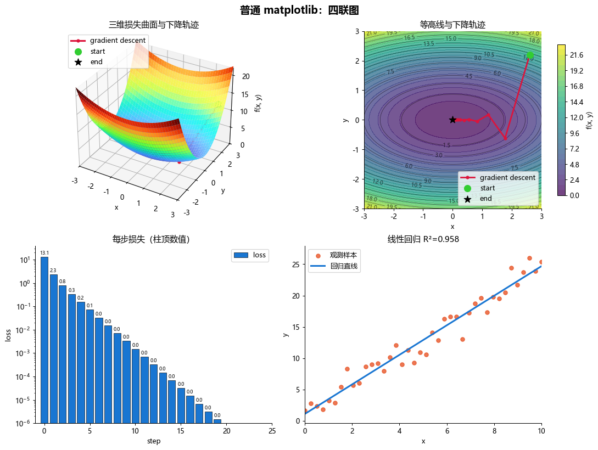

[点击展开] 版本 B：MultiPlotter（同一张四联图）

~~~python
from multiplotter import MultiPlotter

plotter = MultiPlotter(ncols=2, figsize_per_plot=(6, 4.5), dpi=90)

# 子图 0：三维曲面 + 轨迹 + 起止点
plotter.add_surface(
    GRID_X, GRID_Y, GRID_Z, subplot=0,
    title="三维损失曲面与下降轨迹",
    xlabel="x", ylabel="y", zlabel="f(x, y)",
    cmap="turbo", edgecolor="none", alpha=0.9,
    light_enhance={"azdeg": 315, "altdeg": 55, "vert_exag": 1.8},
    view={"elev": 32, "azim": -60, "box_aspect": (1, 1, 0.8),
          "xlim": (-3, 3), "ylim": (-3, 3), "zlim": (0, 22)},
)
plotter.add_line3d(
    PATH_X, PATH_Y, PATH_Z, subplot=0,
    color="crimson", linewidth=2.5, marker="o", markersize=4,
    label="gradient descent", legend=True,
    legend_kwargs={"loc": "upper left"},
)
plotter.add_scatter3d(
    PATH_X[0], PATH_Y[0], PATH_Z[0], subplot=0,
    color="limegreen", s=90, marker="o", depthshade=False,
    label="start", legend=True,
)
plotter.add_scatter3d(
    PATH_X[-1], PATH_Y[-1], PATH_Z[-1], subplot=0,
    color="black", s=110, marker="*", depthshade=False,
    label="end", legend=True,
)

# 子图 1：等高线 + 轨迹
plotter.add_contour(
    GRID_X, GRID_Y, GRID_Z, subplot=1,
    title="等高线与下降轨迹",
    xlabel="x", ylabel="y",
    levels=30, line_levels=15, cmap="viridis",
    contour_kwargs={"colors": "black", "linewidths": 0.5, "alpha": 0.65},
    clabel=True,
    colorbar=True,
    colorbar_kwargs={"shrink": 0.85, "label": "f(x, y)"},
    view={"aspect": "equal", "xlim": (-3, 3), "ylim": (-3, 3), "grid": True},
)
plotter.add_plot(
    kind="line", x=PATH_X, y=PATH_Y, subplot=1,
    color="crimson", linewidth=2.2, marker="o", markersize=4,
    label="gradient descent", legend=True, zorder=5,
)
plotter.add_plot(
    kind="scatter", x=PATH_X[0], y=PATH_Y[0], subplot=1,
    color="limegreen", s=90, label="start", legend=True, zorder=6,
)
plotter.add_plot(
    kind="scatter", x=PATH_X[-1], y=PATH_Y[-1], subplot=1,
    color="black", s=110, marker="*", label="end", legend=True, zorder=6,
    legend_kwargs={"loc": "lower right"},
)

# 子图 2：收敛柱状图（柱顶数值 + 对数轴）
plotter.add_plot(
    kind="bar", x=CONVERGENCE, y=PATH_Z, subplot=2,
    title="每步损失（柱顶数值）",
    xlabel="step", ylabel="loss",
    color="#1976D2", edgecolor="black", linewidth=0.5,
    show_values=True, value_format=".1f", value_offset=2,
    value_kwargs={"fontsize": 7, "rotation": 90},
    label="loss", legend=True,
    view={"xlim": (-1, CONVERGENCE.size), "ylim": (1e-6, PATH_Z.max() * 3),
          "yscale": "log", "grid": True},
)

# 子图 3：散点 + 回归直线
plotter.add_plot(
    kind="scatter", x=XS, y=YS, subplot=3,
    color="#E64A19", s=34, alpha=0.75, label="观测样本", legend=True,
)
plotter.add_plot(
    kind="line", x=XS, y=Y_FIT, subplot=3,
    title=f"线性回归 R²={R2:.3f}",
    xlabel="x", ylabel="y",
    color="#1976D2", linewidth=2.4, label="回归直线", legend=True,
    legend_kwargs={"loc": "upper left"},
    view={"xlim": (0, 10), "ylim": (YS.min() - 2, YS.max() + 2),
          "grid": True},
)

fig, axes = plotter.draw(show=False)
fig.savefig("02_compare_multiplotter.png", dpi=90, bbox_inches="tight")
~~~

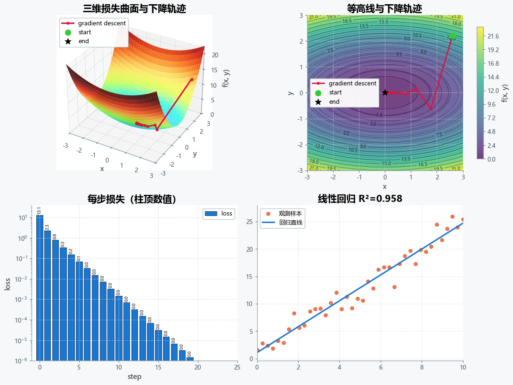

### 0.3 完整对比示例：数据准备

上面两段代码共用同一份数据。这段数据也是后面动画的基础：

~~~python
import numpy as np

def loss_function(x, y):
    return 0.5 * x ** 2 + 2.0 * y ** 2

def gradient_descent(start, lr=0.32, steps=24):
    x, y = start
    path_x, path_y = [x], [y]

    for _ in range(steps):
        grad_x, grad_y = x, 4.0 * y
        x -= lr * grad_x
        y -= lr * grad_y
        path_x.append(x)
        path_y.append(y)

    return np.array(path_x), np.array(path_y)

# 曲面网格
GRID = np.linspace(-3, 3, 160)
GRID_X, GRID_Y = np.meshgrid(GRID, GRID)
GRID_Z = loss_function(GRID_X, GRID_Y)

# 梯度下降轨迹
PATH_X, PATH_Y = gradient_descent((2.6, 2.2))
PATH_Z = loss_function(PATH_X, PATH_Y)
CONVERGENCE = np.arange(PATH_Z.size)

# 线性回归用的观测样本
_RNG = np.random.default_rng(7)
XS = np.linspace(0, 10, 40)
YS = 2.4 * XS + 1.6 + _RNG.normal(0, 1.8, XS.size)
SLOPE, INTERCEPT = np.polyfit(XS, YS, 1)
Y_FIT = SLOPE * XS + INTERCEPT
R2 = 1 - np.sum((YS - Y_FIT) ** 2) / np.sum((YS - YS.mean()) ** 2)
~~~

### 0.4 示意速查表

| 想做的事 | 普通 matplotlib | MultiPlotter |
| --- | --- | --- |
| 建画布 | `plt.figure(figsize=(12, 9), dpi=90, constrained_layout=True)` | `MultiPlotter(ncols=2, figsize_per_plot=(6, 4.5), dpi=90)` |
| 定位子图 | `fig.add_subplot(grid[0, 0], projection="3d")` | `subplot=0`（配 `projection` 由 `dimension` 决定） |
| 曲面光照 | `LightSource(...).shade(...)` + `facecolors=` | `light_enhance={"azdeg": 315, "altdeg": 55, "vert_exag": 1.8}` |
| 三维视角 | `ax.view_init(elev=32, azim=-60)` + `set_box_aspect(...)` | `view={"elev": 32, "azim": -60, "box_aspect": (1, 1, 0.8)}` |
| 坐标范围 | `ax.set_xlim(...)` / `set_ylim(...)` / `set_zlim(...)` | `view={"xlim": ..., "ylim": ..., "zlim": ...}` |
| 坐标比例 | `ax.set_aspect("equal")` | `view={"aspect": "equal"}` |
| 网格 | `ax.grid(True)` | `view={"grid": True}` |
| 对数轴 | `ax.set_yscale("log")` | `view={"yscale": "log"}` |
| 公共文案 | 每个 `ax` 各写一次 `set_title` / `set_xlabel` / `set_ylabel` | 写在任意一层，`draw()` 用 `_first_nonempty` 汇总 |
| 图例 | `label=` + `ax.legend(loc="upper left")` | `label=` + `legend=True` + `legend_kwargs={"loc": "upper left"}` |
| 柱顶数值 | `ax.bar_label(ax.containers[0], labels=[f"{v:.1f}" for v in PATH_Z])` | `show_values=True, value_format=".1f", value_offset=2` |
| 颜色条 | `fig.colorbar(filled, ax=ax2, shrink=0.85, label="f(x, y)")` | `colorbar=True, colorbar_kwargs={"shrink": 0.85, "label": "f(x, y)"}` |
| 等高线标签 | `ax.clabel(lines, inline=True, fontsize=8, fmt="%.1f")` | `clabel=True` |
| 保存 | `fig.savefig("...png", dpi=90, bbox_inches="tight")` | `plotter.draw(show=False, save_path="...png")` |
| 补动画 | 静态图代码基本要重写成 `FuncAnimation` | 同一个对象 `plotter.animate(...)` |

### 0.5 在同一张图上补动画

MultiPlotter 版本画完静态图后，**不需要重写任何绘制代码**就能加动画：
把基类换成 `AnimationPlotter`，`draw()` 之后调用 `animate()` 即可。
下面这段把三维轨迹、二维轨迹、收敛柱状图同步推进：

[点击展开] 版本 C：AnimationPlotter 动画

~~~python
from multiplotter import AnimationPlotter

plotter = AnimationPlotter(ncols=2, figsize_per_plot=(6, 4.5), dpi=100)

# … 与版本 B 相同的 add_surface / add_line3d / add_contour / add_plot，
#   只是每个参与动画的子图都必须在 view 里写死范围（动画要求固定坐标轴）
plotter.draw(show=False)

# 取已经画好的 artist，用 artists 模式原地更新（不 clear、不重画）
ax3d = plotter.get_axes(0)
ax2d = plotter.get_axes(1)
axbar = plotter.get_axes(2)

line_3d = ax3d.lines[0]
line_2d = ax2d.lines[0]
bars = axbar.patches

for bar in bars:
    bar.set_height(0.0)

def update(frame):
    steps = frame + 1
    line_3d.set_data_3d(PATH_X[:steps], PATH_Y[:steps], PATH_Z[:steps])
    line_2d.set_data(PATH_X[:steps], PATH_Y[:steps])

    for index, bar in enumerate(bars):
        bar.set_height(PATH_Z[index] if index < steps else 0.0)

    ax3d.set_title(f"三维损失曲面与下降轨迹（step {steps}）")
    return line_3d, line_2d, *bars

plotter.animate(
    subplots=[0, 1, 2],          # 这三个子图同步推进
    frames=PATH_Z.size,
    interval=120,
    blit=False,
    update_mode="artists",       # 原地更新，回调里不要 clear()
    update_func=update,
    save_path="03_compare_animated.gif",
    fps=8,
    dpi=80,
)
~~~

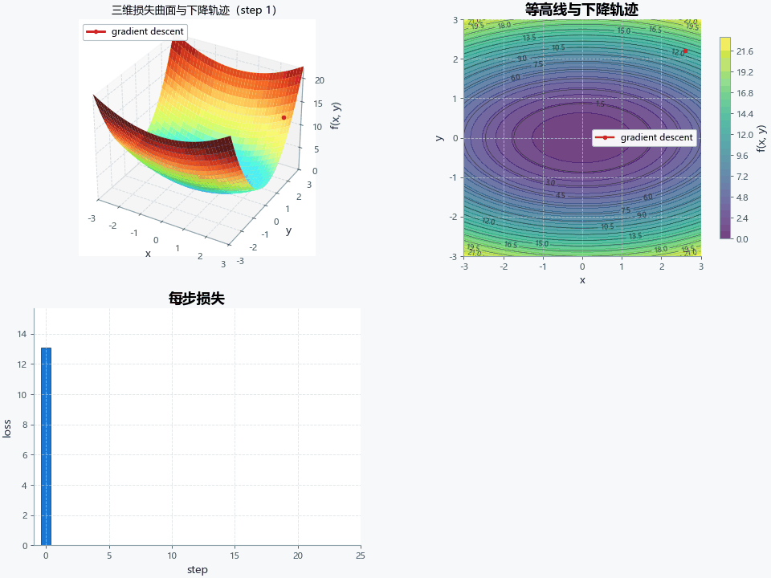

注意三个要点（完整说明见 [ANIMATION.md](ANIMATION.md)）：

1. **参与动画的子图必须在 `view` 里写死范围**，否则每帧自动缩放会让画面抖动；
2. `update_mode="artists"` 时回调里**不要** `clear()`，用 `set_data_3d()` /
   `set_height()` 原地更新，并返回被更新的 artist；
3. 回调里的 `ax` 是框架传进来的，**不要用 `plt.gca()`** 取坐标轴。

---

## 1. 导入和创建对象

安装后（见 [README.md 第 1 章](README.md#1-安装)）直接导入：

~~~python
from multiplotter import MultiPlotter

plotter = MultiPlotter(
    ncols=2,
    figsize_per_plot=(7, 5),
    dpi=130,
)
~~~

构造参数：

| 参数 | 类型 | 默认值 | 说明 |
| --- | --- | --- | --- |
| `ncols` | int | 2 | 每行子图数量 |
| `figsize_per_plot` | tuple | (6, 4) | 每个子图的宽和高，单位为英寸 |
| `dpi` | int | 120 | 图像分辨率 |
| `theme` | str / dict / Theme | `None` | 主题；`None` 用默认浅色主题，见[第 2 章](#2-matplotlib-初始化设置) |

`subplot` 从 0 开始编号。`ncols=2` 时按行优先排列：

~~~text
subplot=0    subplot=1
subplot=2    subplot=3
subplot=4    subplot=5
~~~

子图总数由“最大 subplot 序号 + 1”决定，中间的空白子图会被自动隐藏。

### 1.1 三个类的分工

| 类 | 用途 | 导入 |
| --- | --- | --- |
| `MultiPlotter` | 静态二维 / 三维绘图 | `from multiplotter import MultiPlotter` |
| `AnimationPlotter` | 在 `MultiPlotter` 之上增加 `animate()` | `from multiplotter import AnimationPlotter` |
| `PlotBuilder` | `MultiPlotter.init()` 返回的会话对象 | `from multiplotter import PlotBuilder` |

### 1.2 兼容旧写法

重构后代码已经拆成 `multiplotter/` 包，但**旧的导入方式仍然可用**：

~~~python
# 旧写法（仍然有效）
from Multiplotter import MultiPlotter, AnimationPlotter, PlotBuilder

# 新写法（推荐）
from multiplotter import MultiPlotter, AnimationPlotter, PlotBuilder
~~~

包根目录的 `multiplotter.py` 现在只是一个转发模块，没有自己的实现。

> **要扩展类方法（新增自己的图层、修改默认样式）？**
> 请看 **[EXTENDING.md](EXTENDING.md)**：包结构、图层契约、
> 用 `register_layer()` 一次注册新图层、样式作用域、API 稳定性标记，
> 以及常见错误清单与可复制模板。

---

## 2. matplotlib 初始化设置

样式（主题）集中在 `multiplotter/styles.py`，由 `Theme` 对象描述：

| 主题 | 名称 | 主要作用 |
| --- | --- | --- |
| 浅色（默认） | `"default"` / `"2d"` / `"light"` | 浅灰画布 `#F7F8FA`、**白色**坐标轴面板、中文字体、虚线网格、默认配色、`savefig.dpi=300` |
| 深色面板 | `"surface"` / `"3d"` / `"dark"` | 同上，但坐标轴面板为 **黑色** `#000000` |

### 2.1 样式是怎么生效的（重要变化）

重构前 `draw()` 会直接调用 `matplotlib_option()` /
`matplotlib_surface_option()`，也就是无条件执行：

~~~python
plt.style.use("default")     # 覆盖用户自己的风格
plt.rcParams.update({...})   # 修改整个 Python 进程的全局配置
~~~

这有几个副作用：多个 `MultiPlotter` 对象互相影响、覆盖用户外部设置的样式、
在服务端/多线程环境有竞态风险、`draw()` 会覆盖用户在此之前设置的 `rcParams`。

现在默认改为：

~~~text
draw(style_scope="context")   # 默认
    -> 主题放进 matplotlib.rc_context() 里临时生效
    -> 画完自动恢复全局 plt.rcParams
    -> 不调用 plt.style.use("default")
~~~

具体做法：

1. **rcParams 用上下文临时应用**：`with theme.rc_context(): fig = plt.figure(...)`；
2. **样式是实例级配置**：保存在 `plotter.theme`，不是模块级全局变量；
3. **优先直接设置 Figure / Axes 属性**：坐标轴面板颜色用
   `ax.set_facecolor(...)` 按维度单独设置，不经过 rcParams，
   所以二维 / 三维混排时互不干扰；
4. **不再无条件重置为 default**：想恢复默认外观请显式传 `theme="default"`。

验证不污染全局状态：

~~~python
import matplotlib.pyplot as plt
from multiplotter import MultiPlotter

plt.rcParams["axes.titlesize"] = 30
plt.rcParams["axes.grid"] = False

plotter = MultiPlotter(ncols=1)
plotter.add_plot(kind="line", x=[0, 1, 2], y=[0, 1, 4])
plotter.draw(show=False)

print(plt.rcParams["axes.titlesize"])   # 30   —— 没有被覆盖
print(plt.rcParams["axes.grid"])        # False
~~~

### 2.2 主题的三种写法

~~~python
from multiplotter import MultiPlotter, Theme

# ① 名称
plotter = MultiPlotter(ncols=2, theme="surface")

# ② rcParams 字典（叠加在默认主题上）
plotter = MultiPlotter(ncols=2, theme={
    "axes.grid": False,
    "figure.facecolor": "#FFFFFF",
    "font.size": 11,
})

# ③ Theme 对象（完全自定义，可从内置主题派生）
from multiplotter import TWO_D_THEME

mine = TWO_D_THEME.with_overrides(
    {"axes.grid": False}, name="my-theme", facecolor="#F0F4F8"
)
plotter = MultiPlotter(ncols=2, theme=mine)
~~~

也可以只在某一次绘制时覆盖：

~~~python
plotter.draw(show=False, theme="surface")
~~~

### 2.3 内置主题的 rcParams

`TWO_D_RC`（浅色）与 `SURFACE_RC`（深色）共用的基础项：

~~~python
{
    "figure.figsize": (9, 6),          # 默认画布大小
    "figure.dpi": 120,                 # 显示分辨率
    "figure.facecolor": "#F7F8FA",     # 画布背景
    "savefig.facecolor": "#F7F8FA",    # 保存时的画布背景
    "savefig.dpi": 300,                # 保存图片的分辨率
    "savefig.bbox": "tight",           # 保存时裁剪空白
    "axes.edgecolor": "#90A4AE",       # 坐标轴边框颜色
    "axes.linewidth": 1.0,
    "axes.grid": True,                 # 默认显示网格
    "grid.color": "#CFD8DC",
    "grid.linestyle": "--",
    "grid.linewidth": 0.8,
    "grid.alpha": 0.65,
    "axes.titlesize": 16,              # 标题字号
    "axes.titleweight": "bold",
    "axes.labelsize": 12,              # 坐标轴标签字号
    "axes.labelcolor": "#263238",
    "xtick.labelsize": 10,
    "ytick.labelsize": 10,
    "xtick.color": "#455A64",
    "ytick.color": "#455A64",
    "axes.prop_cycle": cycler(color=[...]),  # 默认配色
    "legend.fontsize": 10,
    "legend.framealpha": 0.95,
    "font.sans-serif": [...],          # 中文字体在前、西文字体在后的回退链
    "axes.unicode_minus": False,       # 正常显示负号
}
~~~

两者的唯一区别是坐标轴面板颜色：

~~~python
"axes.facecolor": "#FFFFFF",   # 二维：浅色面板
"axes.facecolor": "#000000",   # 三维：深色面板
~~~

### 2.4 三点说明

- **字体**：`font.sans-serif` 由三份候选表拼成 ——
  `CHINESE_FONT_CANDIDATES`（25 项，覆盖 Windows / macOS / **Linux** 的中文字体）、
  `SANS_FONT_CANDIDATES`（17 项西文字体）、`FALLBACK_FONTS`（兜底）。
  顺序是**中文字体在前、西文字体在后**，系统里没装的会自动跳过，
  因此中文标题不会变成方框，英文与数学符号也有合适字形。
  这个列表由 `pick_sans_fonts()` 计算并缓存（旧名字 `pick_chinese_fonts()` 等价）。
  各发行版的安装命令见 [README.md 的字体一节](README.md#字体)。
- **二维与三维混排**：面板颜色在创建坐标轴时按维度直接设置，
  即使同一个画布上既有三维子图又有二维子图，二维子图也会保持浅色面板，
  不会被三维设置覆盖。
- **旧接口仍然可用**：`matplotlib_option()` 与 `matplotlib_surface_option()`
  保留原语义（显式修改全局 `plt.rcParams`，含 `plt.style.use("default")`）。
  只有在 `draw(style_scope="global")` 时框架才会调用它们。

### 2.5 样式作用域与生命周期对照

| `style_scope` | 生效范围 | 何时恢复 | 适用场景 |
| --- | --- | --- | --- |
| `"context"`（默认） | 创建 Figure / Axes 期间 | `draw()` 返回时自动恢复 | 绝大多数场景；多对象、服务端、测试 |
| `"global"` | 整个 Python 进程 | 不恢复（与旧行为一致） | 需要所有后续 matplotlib 代码都沿用该样式 |

主题本身的生命周期跟随对象：`MultiPlotter(theme=...)` 设置后一直有效，
`draw(theme=...)` 只影响那一次绘制，`plotter.theme = "surface"` 可以随时改。

---

## 3. init() 快速绘图：只写初始化设置

前面两章讲的都是「逐个图层写全参数」。如果你要画很多张图，或者一张图里叠好几层，
参数会大量重复。`MultiPlotter.init()` 就是为了解决这个问题：

> **把初始化设置写一次，之后每次只需要给 `kind` 和数据。**

### 3.1 一句话理解

~~~python
from Multiplotter import MultiPlotter

plotter = MultiPlotter.init(
    ncols=2, dpi=120,
    title="实验结果", xlabel="x", ylabel="y",
    legend=True, cell_fontsize=11,
)

plotter.add(kind="line", x=x, y=y, subplot=0)              # 只给数据
plotter.add(kind="surface", x=X, y=Y, z=Z, subplot=1)      # 光照增强自动开启
plotter.add(kind="correlation", data=samples, subplot=2)   # 数值自动显示

fig, axes = plotter.draw(show=False, save_path="out/result.png")
~~~

对比一下传统写法：

~~~python
# 传统写法：每个图层都要把参数写全
plotter = MultiPlotter(ncols=2, dpi=120)
plotter.add_plot(kind="line", x=x, y=y, subplot=0, title="实验结果",
                 xlabel="x", ylabel="y", linewidth=2.5,
                 view={"xlim": (0, 6.3), "grid": True})
plotter.add_surface(X, Y, Z, subplot=1, title="曲面",
                    cmap="turbo", edgecolor="none", alpha=0.92,
                    light_enhance={"azdeg": 315, "altdeg": 55,
                                   "gamma": 0.65, "vert_exag": 1.8},
                    colorbar=True,
                    view={"elev": 30, "azim": -60,
                          "box_aspect": (1, 1, 0.7)})
plotter.add_correlation_heatmap(samples, labels=labels, subplot=2,
                                show_values=True, value_format=".2f",
                                cmap="coolwarm", colorbar=True)
fig, axes = plotter.draw(show=False)
fig.savefig("out/result.png")
~~~

### 3.2 参数优先级

从低到高，后面的覆盖前面的：

~~~text
① kind 预设（KIND_DEFAULTS）    ← 类里已经写好，不用管
② init() 的全局设置             ← 写一次，所有图层生效
③ init(style={...})             ← 同上，字典形式
④ for_subplot(1, ...)           ← 只对某个子图生效
⑤ add() 的参数                  ← 就地覆盖
⑥ add() 的 **kwargs             ← 优先级最高
~~~

### 3.3 MultiPlotter.init() 的参数

| 参数 | 默认值 | 说明 |
| --- | --- | --- |
| `ncols` | 2 | 每行子图数量 |
| `figsize_per_plot` | (6, 4) | 每个子图的宽高 |
| `dpi` | 120 | 分辨率 |
| `style` | None | 用字典一次给出所有全局样式 |
| `subplot` | 0 | 默认子图序号，`add()` 里可以覆盖 |
| `title` | "" | 默认标题 |
| `xlabel` / `ylabel` / `zlabel` | None | 默认坐标轴标签 |
| `xlim` / `ylim` / `zlim` | None | 默认坐标轴范围，会写进 `view` |
| `**style_overrides` | — | 其它全局样式，见下表 |

**可用的全局样式键**（`**style_overrides` 与 `style` 字典都支持）：

| 分类 | 键 |
| --- | --- |
| 字体 | `cell_fontsize`、`header_fontsize`、`text_fontsize`、`fontsize` |
| 网格 | `grid`、`grid_linestyle`、`grid_alpha`、`grid_color` |
| 坐标轴 | `axis`、`scale`、`aspect`、`xscale`、`yscale`、`axis_off`、`ticks_rotation` |
| 图例 | `legend`、`legend_kwargs`、`label` |
| 通用样式 | `cmap`、`color`、`alpha`、`linewidth`、`marker`、`markersize`、`linestyle`、`edgecolor`、`s`、`zorder` |
| 数值标注 | `show_values`、`value_format`、`value_offset`、`value_kwargs`、`value_selection`、`max_value_labels`、`value_threshold` |
| 颜色条 | `colorbar`、`colorbar_kwargs` |
| 数据范围 | `vmin`、`vmax` |

注意：只有**显式设置过**的键才生效，值为 `None` 的会被忽略，
不会把图层预设里的值覆盖掉。

### 3.4 add() 的三种写法

~~~python
# ① 字典传数据（推荐，结构清晰）
plotter.add("line", {"x": x, "y": y})
plotter.add("surface", {"x": X, "y": Y, "z": Z})

# ② 关键字传数据
plotter.add("line", x=x, y=y)
plotter.add("quiver", x=X, y=Y, u=U, v=V)

# ③ 传数组，按 kind 自动推断参数名
plotter.add("hist", samples)              # -> x=samples
plotter.add("heatmap", matrix)            # -> data=matrix
plotter.add("image", image_array)         # -> image=image_array
plotter.add("table", table_data)          # -> cell_text=table_data
~~~

`add()` 返回 `self`，可以链式调用：

~~~python
(session := MultiPlotter.init(ncols=3, dpi=120)) \
    .add("line", x=x, y=y, subplot=0) \
    .add("scatter", x=x, y=y, subplot=1) \
    .add("bar", x=cats, y=values, subplot=2)

session.draw(show=False)
~~~

### 3.5 每个 kind 的预设（init() 已经设置好的内容）

下面这些参数**不写就是默认值**，写 `add()` 时随时可以覆盖：

| kind | 预设好的内容 |
| --- | --- |
| `line` | `linewidth=2.5`、`xlabel="x"`、`ylabel="y"` |
| `scatter` | `s=42`、`alpha=0.85`、`edgecolors="none"` |
| `bar` | `edgecolor="black"`、**`show_values=True`**、`value_format=".2f"` |
| `hist` | `bins=30`、`edgecolor="white"`、**`show_values=True`** |
| `pie` | **`show_values=True`**、`startangle=90`、白色扇形描边 |
| `heatmap` | `cmap="viridis"`、**`show_heatmap_values=True`**、`colorbar=True` |
| `correlation` | **`show_values=True`**、`cmap="coolwarm"`、`colorbar=True`、`aspect="equal"` |
| `image` | `cmap="viridis"`、`interpolation="nearest"`、`colorbar=True` |
| `contour` | `levels=30`、`line_levels=15`、`clabel=True`、`colorbar=True`、`aspect="equal"` |
| `surface` | **`light_enhance` 默认开启**、`cmap="turbo"`、`edgecolor="none"`、`alpha=0.92`、`colorbar=True`、`view={"elev":30,"azim":-60,"box_aspect":(1,1,0.7)}` |
| `line3d` | `linewidth=3.0`、`marker="o"`、`highlight_zorder=100`、3D 视角与 `box_aspect` |
| `scatter3d` | `s=40`、`alpha=0.85`、`depthshade=True`、`highlight_zorder=101` |
| `bar3d` | `color="steelblue"`、**`show_values=True`**、`value_selection="auto"`、`max_value_labels=12` |
| `hist3d` | `bins=(18,18)`、**`show_values=True`**、`value_selection="auto"`、`max_value_labels=12` |
| `quiver` | `cmap="turbo"`、`colorbar=True`、`width=0.004`、`aspect="equal"` |
| `streamplot` | `density=1.4`、`line_width=1.3`、`cmap="turbo"`、`colorbar=True` |
| `quiver3d` | `density=11`、`length=0.5`、`cmap="turbo"`、`colorbar=True` |
| `stream3d` | `n_seeds=9`、`step_size=0.05`、`color="#C62828"`、固定颜色的流线 |
| `table` | 表头配色、斑马纹、行标题配色、`bbox`、`view={"xlim":(0,1),"ylim":(0,1)}` |

查看某个 kind 的预设：

~~~python
method, defaults = MultiPlotter.kind_presets("surface")
print(method)      # add_surface
print(defaults)    # {'cmap': 'turbo', 'light_enhance': {...}, ...}
~~~

`kind` 还支持这些别名：

~~~text
corr / correlation_matrix / correlation_heatmap  ->  correlation
vector                                          ->  quiver
flow / streamline                               ->  streamplot
vector3d                                        ->  quiver3d
streamline3d                                    ->  stream3d
~~~

### 3.6 只写 kind 和数据就能出图

19 种图层都可以只给数据：

~~~python
plotter = MultiPlotter.init(ncols=2, dpi=120)

plotter.add("line",       {"x": x, "y": y})
plotter.add("scatter",    {"x": x, "y": y})
plotter.add("bar",        {"x": ["A", "B"], "y": [1.0, 2.0]})
plotter.add("hist",       {"x": samples})
plotter.add("pie",        {"labels": ["A", "B", "C"], "values": [3, 2, 5]})
plotter.add("heatmap",    {"data": matrix})
plotter.add("correlation",{"data": samples})
plotter.add("image",      {"image": image_array})
plotter.add("contour",    {"x": X, "y": Y, "z": Z})
plotter.add("surface",    {"x": X, "y": Y, "z": Z})
plotter.add("line3d",     {"x": x, "y": y, "z": z})
plotter.add("scatter3d",  {"x": x, "y": y, "z": z})
plotter.add("bar3d",      {"x": x, "y": y, "z": z,
                           "dx": 0.7, "dy": 0.7, "dz": height})
plotter.add("hist3d",     {"x": samples_x, "y": samples_y})
plotter.add("quiver",     {"x": X, "y": Y, "u": U, "v": V})
plotter.add("streamplot", {"x": X, "y": Y, "u": U, "v": V})
plotter.add("quiver3d",   {"x": X, "y": Y, "z": Z,
                           "u": U, "v": V, "w": W})
plotter.add("stream3d",   {"x": X, "y": Y, "z": Z, "u": U, "v": V, "w": W,
                           "field_func": vortex})
plotter.add("table",      {"cell_text": table_data},
            col_labels=["基线", "量化"], row_labels=["准确率", "召回率"])

fig, axes = plotter.draw(show=False)
~~~

### 3.7 完整示例：从初始化到出图

~~~python
import numpy as np

from Multiplotter import MultiPlotter

# ---------------- 数据 ----------------
x = np.linspace(0, 2 * np.pi, 200)
y = np.sin(x)

grid = np.linspace(-3, 3, 160)
X, Y = np.meshgrid(grid, grid)
Z = 0.5 * X ** 2 + 2.0 * Y ** 2

rng = np.random.default_rng(7)
samples = np.column_stack([
    rng.normal(25, 4, 200),
    rng.normal(0, 1, 200),
    rng.normal(0, 1, 200),
    rng.normal(0, 1, 200),
])

# ---------------- 初始化设置：只写一次 ----------------
plotter = MultiPlotter.init(
    ncols=2,
    figsize_per_plot=(6, 4.5),
    dpi=120,
    legend=True,
    grid=True,
    grid_linestyle="--",
    cell_fontsize=11,
)

# ---------------- 只给 kind + 数据 ----------------
plotter.add(
    "line", {"x": x, "y": y},
    subplot=0, title="正弦曲线",
    xlabel="x", ylabel="y", color="#1976D2", label="sin(x)",
)

plotter.add(
    "surface", {"x": X, "y": Y, "z": Z},
    subplot=1, title="二次曲面",
    xlabel="x", ylabel="y", zlabel="f(x, y)",
    # 光照增强、cmap、视角都是预设好的，不用写
)

plotter.add(
    "correlation", {"data": samples},
    subplot=2, title="特征相关性",
    # 单元格数值默认显示，不用写 show_values=True
)

plotter.add(
    "bar", {"x": ["甲", "乙", "丙", "丁"], "y": [12.4, 18.6, 9.8, 15.2]},
    subplot=3, title="分组结果",
    # 柱顶数值默认标注
)

# ---------------- 一次出图 + 保存 ----------------
fig, axes = plotter.draw(show=False, save_path="output/init_demo.png")
~~~

上面这段代码的运行结果（4 个子图，光照增强、相关性数值、柱顶数值全是默认开的）：

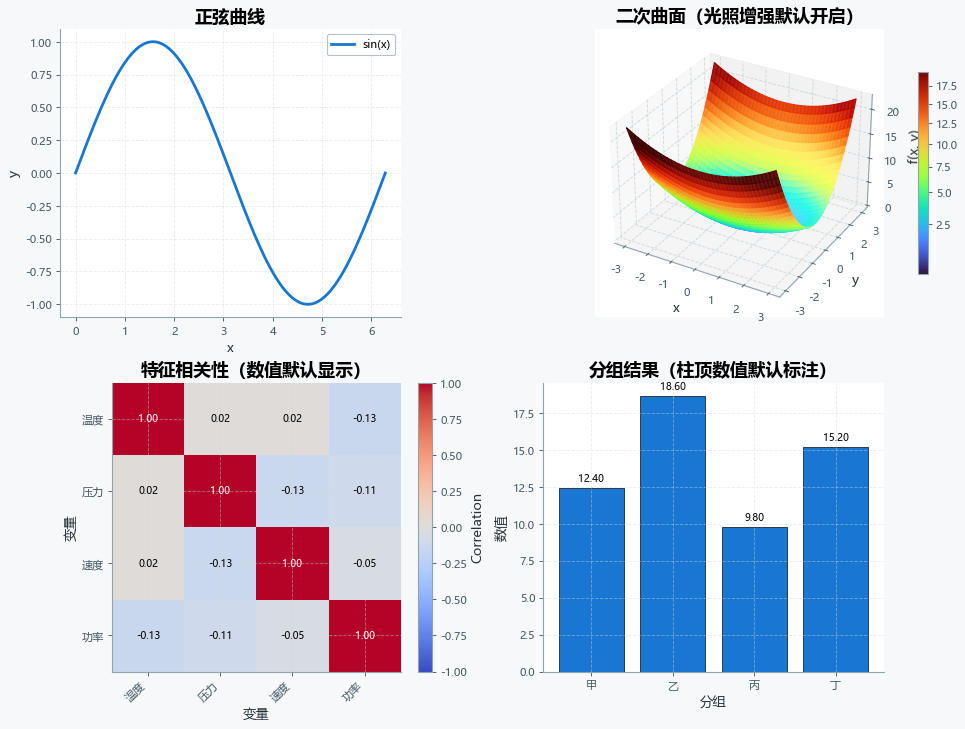

### 3.8 更多用法

**查看每次 add 的最终参数**（调试用）：

~~~python
plotter.add("line", {"x": x, "y": y})
for record in plotter.get_records():
    print(record["kind"], record["method"], record["subplot"])
    print("  最终参数:", sorted(record["params"]))
~~~

**查看被丢弃的样式键**：如果全局样式里写了某个图层用不到的键
（例如给折线传 `cell_fontsize`），不会报错，但会记录在这里：

~~~python
print(plotter.get_dropped_keys())
# {'line': ['cell_fontsize']}
~~~

**追加/修改全局设置**：

~~~python
plotter = MultiPlotter.init(ncols=2)
plotter.configure(legend=True, cell_fontsize=12)     # 追加全局设置
plotter.for_subplot(1, aspect="equal", title="子图1")  # 只对子图 1 生效
~~~

**范围简写**：

~~~python
plotter.add("line", x=x, y=y, lims=((0, 6.3), (-1.5, 1.5)))   # xlim, ylim
~~~

**一次加多层**：

~~~python
plotter.add_many(
    ("line", {"x": x, "y": y}),
    ("scatter", {"x": x, "y": y}),
    ("bar", {"x": cats, "y": values}),
)
~~~

**清空图层但保留初始化设置**：

~~~python
plotter.clear()          # 图层清空，init() 的设置还在，可以继续 add
~~~

**和动画配合**：`AnimationPlotter.init()` 同样可用。
`init()` 会按调用它的类创建对应的实例，所以拿到的就是带 `animate()` 的会话：

~~~python
from Multiplotter import AnimationPlotter

plotter = AnimationPlotter.init(ncols=1, dpi=100, legend=True)
plotter.add("line", x=x, y=y, label="sin",
            view={"xlim": (0, 2 * np.pi), "ylim": (-1.5, 1.5)})
plotter.draw(show=False)

line = plotter.get_axes(0).lines[0]

def update(frame):
    line.set_data(x, np.sin(x - frame / 5))
    return line,

plotter.animate(frames=30, update_mode="artists", blit=True,
                update_func=update, save_path="output/anim.gif", fps=20)
~~~

### 3.9 init() 与普通写法的对照

| 你想做的事 | 普通写法 | init() 写法 |
| --- | --- | --- |
| 建画布 | `MultiPlotter(ncols=2, dpi=120)` | `MultiPlotter.init(ncols=2, dpi=120)` |
| 统一标题/标签 | 每个 `add_*` 都写一遍 | `init(title=..., xlabel=...)` |
| 统一范围 | 每个 `add_*` 写 `view={"xlim": ...}` | `init(xlim=..., ylim=...)` |
| 统一图例 | 每个 `add_*` 写 `legend=True` | `init(legend=True)` |
| 统一网格 | 每个 `view` 里写 `"grid": True` | `init(grid=True, grid_alpha=0.5)` |
| 统一字体 | 每个表格写 `cell_fontsize` | `init(cell_fontsize=11)` |
| 曲面光照 | `light_enhance={...}` | 默认开启，不用写 |
| 相关性数值 | `show_values=True` | 默认开启，不用写 |
| 柱顶数值 | `show_values=True, value_format=...` | 默认开启，不用写 |
| 加图层 | `add_surface(X, Y, Z, subplot=0, ...)` | `add("surface", {"x": X, "y": Y, "z": Z})` |
| 保存 | `fig.savefig(...)` | `draw(save_path=...)` |

---

## 4. dimension 维度规则

每个配置都包含 `dimension`：

~~~text
dimension=2：二维坐标轴
dimension=3：三维坐标轴
~~~

`dimension` 由 `add_plot`、`add_surface`、`add_contour`、`add_pie` 等方法自动写入，
不需要手动传入。

同一个 subplot 不能同时放二维和三维图层。以下写法会报错：

~~~python
plotter.add_surface(X, Y, Z, subplot=0)
plotter.add_contour(X, Y, Z, subplot=0)   # 与三分维图层冲突
plotter.draw()
~~~

正确布局：

~~~python
plotter.add_surface(X, Y, Z, subplot=0)
plotter.add_contour(X, Y, Z, subplot=1)
~~~

合法的子图组合：

~~~text
三维子图：surface + line3d + scatter3d + bar3d + hist3d 的任意组合
二维子图：contour + line + scatter + bar + hist + pie + heatmap + image 的任意组合
~~~

---

## 5. 二维通用入口：add_plot()

`add_plot()` 保留原有调用方式，支持 `line`、`scatter`、`bar`、`hist`、`pie`、
`heatmap`、`image`。

通用参数：

| 参数 | 默认值 | 说明 |
| --- | --- | --- |
| `kind` | 必填 | 图层类型 |
| `x`、`y` | None | line/scatter/bar/hist/pie 使用的数据 |
| `image` | None | `kind="image"` 使用的图像数组 |
| `data` | None | `kind="heatmap"` 使用的矩阵 |
| `subplot` | 0 | 子图序号 |
| `title`、`xlabel`、`ylabel` | "" | 标题和坐标轴标签 |
| `label` | None | 图例文字 |
| `legend` | True | 是否参与图例 |
| `legend_kwargs` | None | 传给 `ax.legend()` 的参数 |
| `axis` | "" | 坐标轴比例，例如 `"equal"` |
| `show_values` | False | 是否显示数值（bar/hist/pie 有效） |
| `value_format` | ".2f" | 数值格式，支持 `".1f"` 或 `"%.1f"` |
| `value_offset` | 3 | bar/hist 标签与柱顶的距离（像素） |
| `value_kwargs` | None | 传给标签文字的额外样式 |
| `tick_labels` | None | heatmap 的行列名称 |
| `view` | None | 坐标轴范围、比例和网格设置 |
| `show_heatmap_values` | False | heatmap 是否显示单元格数值 |
| `heatmap_value_format` | ".2f" | 热力图数值格式 |
| `**kwargs` | — | 继续传给对应的 Matplotlib 方法 |

说明：

- `line`、`scatter`、`bar` 使用 `x`、`y`；
- `hist` 使用 `x`，直方图参数（`bins`、`density` 等）通过 `kwargs` 传入；
- `pie` 使用 `x` 作为扇区名称、`y` 作为扇区数值，推荐直接用 `add_pie()`；
- `heatmap` 使用 `data`；
- `image` 使用 `image`；
- `kwargs` 会继续传给对应的 Matplotlib 方法，例如 `color`、`linewidth`、
  `marker`、`alpha`、`cmap`、`zorder` 等。

### 5.1 二维折线

~~~python
plotter.add_plot(
    kind="line",
    x=x,
    y=y,
    subplot=0,
    title="二维折线",
    xlabel="x",
    ylabel="y",
    color="crimson",
    linewidth=2.0,
    label="curve",
    legend=True,
)
~~~

### 5.2 二维散点

~~~python
plotter.add_plot(
    kind="scatter",
    x=x,
    y=y,
    subplot=0,
    title="二维散点",
    xlabel="x",
    ylabel="y",
    color="darkorange",
    s=40,
    alpha=0.8,
    label="samples",
    legend=True,
)
~~~

六种基础二维图层（line、scatter、bar、hist、heatmap、image）放在一起的效果：

---

## 6. 二维柱状图与柱顶数值

~~~python
categories = ["一月", "二月", "三月", "四月", "五月", "六月"]
values = [12.4, 18.6, 9.8, 15.2, 21.7, 11.5]

plotter.add_plot(
    kind="bar",
    x=categories,
    y=values,
    subplot=0,
    title="柱顶数值：show_values=True",
    xlabel="月份",
    ylabel="数值",
    color="#1976D2",
    edgecolor="black",
    linewidth=0.6,
    show_values=True,          # 开启柱顶数值
    value_format=".1f",        # 数值格式
    value_offset=3,            # 与柱顶的距离（像素）
    value_kwargs={"fontsize": 9},
)
~~~

数值标注参数：

| 参数 | 说明 |
| --- | --- |
| `show_values` | `True` 时调用 `ax.bar_label()` 标注每根柱子的值；默认 `False`，即不显示 |
| `value_format` | 数值格式，`".0f"` 显示整数，`".2f"` 保留两位小数 |
| `value_offset` | 标签与柱顶的距离，单位是像素 |
| `value_kwargs` | 传给标签文字的样式，例如 `fontsize`、`color`、`rotation` |

`value_kwargs` 中的 `ha`、`va` 会被忽略，因为标签位置由 `bar_label()` 决定。

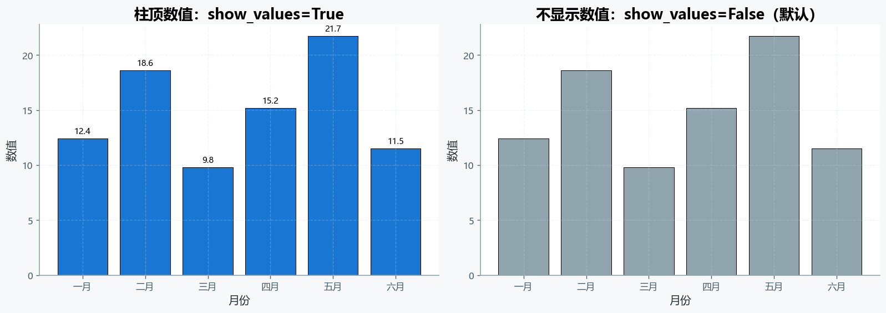

左图开启 `show_values=True`，右图为默认（不显示数值）。

---

## 7. 二维直方图与柱顶数值

~~~python
plotter.add_plot(
    kind="hist",
    x=samples,
    subplot=0,
    title="频数直方图 + 柱顶频数",
    xlabel="数值",
    ylabel="频数",
    bins=24,
    color="#1976D2",
    show_values=True,
    value_format=".0f",
    value_offset=2,
    value_kwargs={"fontsize": 7},
)
~~~

`hist` 的柱顶数值来自 `ax.hist()` 返回的频数数组，所以：

- `density=False`（默认）时，数值表示频数，建议 `value_format=".0f"`；
- `density=True` 时，数值表示密度，建议 `value_format=".3f"` 并把字号调小。

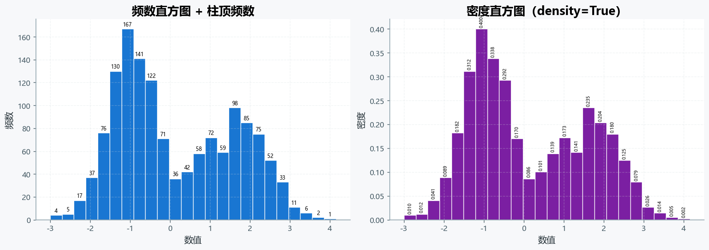

---

## 8. 二维饼图：add_pie()

`add_pie()` 用于绘制二维饼图，`labels` 是扇区名称，`values` 是各扇区数值。

~~~python
industry = ["制造业", "信息技术", "金融", "医疗", "教育"]
share = [32.5, 24.0, 18.5, 14.0, 11.0]

plotter.add_pie(
    labels=industry,
    values=share,
    subplot=0,
    title="show_values=True：扇区显示百分比",
    startangle=90,
    show_values=True,          # 默认就是 True，显示百分比
    value_format=".1f",        # 百分比保留一位小数
    value_kwargs={"fontsize": 9, "color": "#263238"},
    colors=["#1976D2", "#E64A19", "#388E3C", "#7B1FA2", "#F57C00"],
)
~~~

参数：

| 参数 | 默认值 | 说明 |
| --- | --- | --- |
| `labels` | 必填 | 扇区名称，长度必须与 `values` 一致 |
| `values` | 必填 | 扇区数值，必须是非负数且总和大于 0 |
| `subplot` | 0 | 子图序号 |
| `title`、`xlabel`、`ylabel` | "" | 标题和坐标轴标签（饼图默认不显示 X/Y 标签） |
| `legend`、`legend_kwargs` | False、None | 图例设置 |
| `show_values` | True | 是否在扇区上显示百分比 |
| `value_format` | ".1f" | 百分比格式 |
| `value_kwargs` | None | 传给百分比文字，会作为 `textprops` |
| `colors` | None | 扇区颜色列表 |
| `explode` | None | 每个扇区偏离圆心的比例 |
| `autopct` | None | 自定义百分比格式（字符串或函数），传入后覆盖默认的 `show_values` 逻辑 |
| `startangle` | 90 | 起始角度 |
| `**kwargs` | — | 继续传给 `ax.pie()`，例如 `wedgeprops`、`shadow`、`radius` |

注意事项：

- `values` 必须是有限数值，不能有负数，总和必须大于 0；
- `labels`、`colors`、`explode` 的长度都必须与 `values` 一致；
- `show_values=False` 时不会添加百分比文字，适合只显示扇区名称的图；
- 饼图会自动设置 `aspect="equal"`，不需要再传 `axis="equal"`。

只显示扇区名称：

~~~python
plotter.add_pie(
    labels=industry,
    values=share,
    subplot=1,
    startangle=140,
    show_values=False,
    colors=["#1976D2", "#E64A19", "#388E3C", "#7B1FA2", "#F57C00"],
    wedgeprops={"linewidth": 1.0, "edgecolor": "white"},
)
~~~

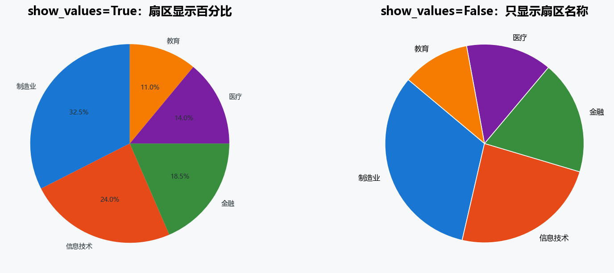

饼图也可以通过通用入口绘制：

~~~python
plotter.add_plot(kind="pie", x=industry, y=share, subplot=0)

plotter.add_layer(kind="pie", labels=industry, values=share, subplot=0)
~~~

`add_layer(kind="pie", ...)` 既可以写 `labels`/`values`，也可以写 `x`/`y`。

---

## 9. 相关性矩阵热力图：add_correlation_heatmap()

`add_correlation_heatmap()` 接收原始样本矩阵或已经计算好的方阵：原始数据形状为
`(样本数, 特征数)`，类会自动按列计算 Pearson 相关系数；同时显示行列特征名、
每个单元格的相关系数和颜色条。

~~~python
plotter.add_correlation_heatmap(
    data=samples,
    labels=["温度", "压力", "速度", "功率"],
    subplot=0,
    title="特征相关性矩阵",
    xlabel="变量",
    ylabel="变量",
    cmap="coolwarm",
    show_values=True,
    value_format=".2f",
    colorbar=True,
    colorbar_kwargs={"label": "相关系数"},
)
~~~

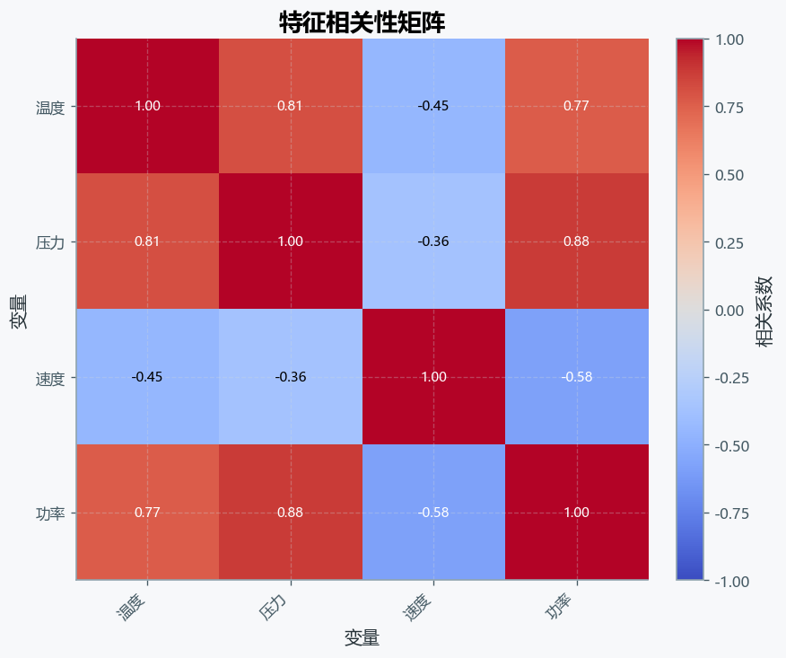

参数：

| 参数 | 默认值 | 说明 |
| --- | --- | --- |
| `data` | 必填 | 原始样本矩阵或方阵相关性矩阵 |
| `labels` | None | 行列名称，长度必须等于矩阵维度 |
| `cmap` | "coolwarm" | 颜色映射 |
| `show_values` | True | 是否显示每个单元格的数值 |
| `value_format` | ".2f" | 单元格数值格式 |
| `colorbar` | True | 是否添加颜色条 |
| `tick_rotation` | 45 | 刻度标签旋转角度 |
| `text_size` | 9 | 单元格数值字号 |

如果已经有相关性矩阵，可以直接传入方阵：

~~~python
corr = np.corrcoef(samples, rowvar=False)
plotter.add_correlation_heatmap(
    corr,
    labels=["温度", "压力", "速度", "功率"],
    show_values=True,
)
~~~

---

## 10. 热力图和图像

~~~python
plotter.add_plot(
    kind="heatmap",
    data=matrix,
    subplot=0,
    title="热力图",
    xlabel="列",
    ylabel="行",
    cmap="viridis",
    show_heatmap_values=True,       # 显示每个单元格的数值
    heatmap_value_format=".1f",
)

plotter.add_plot(
    kind="image",
    image=image_array,
    subplot=1,
    title="图像",
    cmap="gray",
    colorbar=True,                  # image 只有显式传 colorbar 才添加颜色条
)
~~~

`heatmap` 的常用参数：

| 参数 | 说明 |
| --- | --- |
| `data` | 二维矩阵 |
| `cmap` | 颜色映射 |
| `vmin`、`vmax` | 颜色范围 |
| `tick_labels` | 行列名称，长度必须与矩阵行列数一致 |
| `show_heatmap_values` | 是否在每个单元格写数值 |
| `heatmap_value_format` | 单元格数值格式 |
| `heatmap_text_size` | 单元格数值字号 |
| `colorbar` | 是否添加颜色条 |

`image` 的常用参数：`image`、`cmap`、`colorbar`，其余参数继续传给 `ax.imshow()`。

---

## 11. 二维等高线：add_contour()

`add_contour()` 会依次绘制填充等高线、黑色等高线和等高线数值标签，并可添加颜色条。

~~~python
plotter.add_contour(
    X,
    Y,
    Z,
    subplot=0,
    title="二维等高线 + 下降轨迹",
    xlabel="x",
    ylabel="y",
    levels=30,              # 填充区域层数
    line_levels=15,         # 黑色等高线层数（也是被标注的线条数）
    cmap="viridis",
    filled=True,
    alpha=0.75,
    contour_kwargs={
        "colors": "black",
        "linewidths": 0.5,
        "alpha": 0.65,
    },
    clabel=True,
    clabel_kwargs={
        "inline": True,
        "fontsize": 8,
        "fmt": "%.1f",
    },
    colorbar=True,
    colorbar_kwargs={
        "shrink": 0.85,
        "aspect": 20,
        "label": "f(x, y)",
    },
    view={
        "aspect": "equal",
        "grid": True,
    },
)
~~~

主要参数：

| 参数 | 说明 |
| --- | --- |
| `x`、`y` | 一维坐标，或二维网格 X、Y |
| `z` | 二维高度数据，形状为 `(len(y), len(x))` |
| `levels` | 填充等高线层数或层值数组 |
| `line_levels` | 黑色等高线层数或层值数组，默认与 `levels` 相同 |
| `cmap` | 颜色映射 |
| `filled` | 是否绘制 `contourf` |
| `alpha` | 填充透明度 |
| `contourf_kwargs` | 传给 `ax.contourf()` 的参数 |
| `contour_kwargs` | 传给 `ax.contour()` 的参数 |
| `clabel` | 是否显示等高线数值 |
| `clabel_kwargs` | 传给 `ax.clabel()` 的参数 |
| `colorbar`、`colorbar_kwargs` | 颜色条设置 |
| `axis` | 坐标轴比例，默认 `"equal"` |
| `view` | 范围、比例和网格配置 |

等高线数值由 Matplotlib 的 `Axes.clabel()` 添加。常用 `clabel_kwargs`：

| 参数 | 作用 | 示例 |
| --- | --- | --- |
| `inline` | 是否擦除文字下方的线段 | `True` |
| `fontsize` | 标签字号 | `8` |
| `fmt` | 标签数值格式或格式字典 | `"%.1f"`、`"%.2e"` |
| `colors` | 标签颜色 | `"black"`、`"white"` |
| `inline_spacing` | 文字两侧留白像素 | `5` |
| `manual` | 手动指定标签位置 | `[(0, 0), (1, 1)]` |

`levels` 只控制填充层；要减少或增加带数字的线条，应调整 `line_levels`。
如果标签太密，可以降低 `line_levels`，或者用 `manual` 指定少量位置。

等高线应该先添加，轨迹随后添加：

~~~python
plotter.add_contour(X, Y, Z, subplot=0, levels=30, line_levels=15,
                    cmap="viridis", colorbar=True,
                    view={"aspect": "equal"})

plotter.add_plot(kind="line", x=path_x, y=path_y, subplot=0,
                 color="crimson", linewidth=2.2, marker="o",
                 label="gradient descent", legend=True, zorder=5)

plotter.add_plot(kind="scatter", x=path_x[0], y=path_y[0], subplot=0,
                 color="limegreen", s=90, marker="o",
                 label="start", legend=True, zorder=6)

plotter.add_plot(kind="scatter", x=path_x[-1], y=path_y[-1], subplot=0,
                 color="black", s=110, marker="*",
                 label="end", legend=True, zorder=6)
~~~

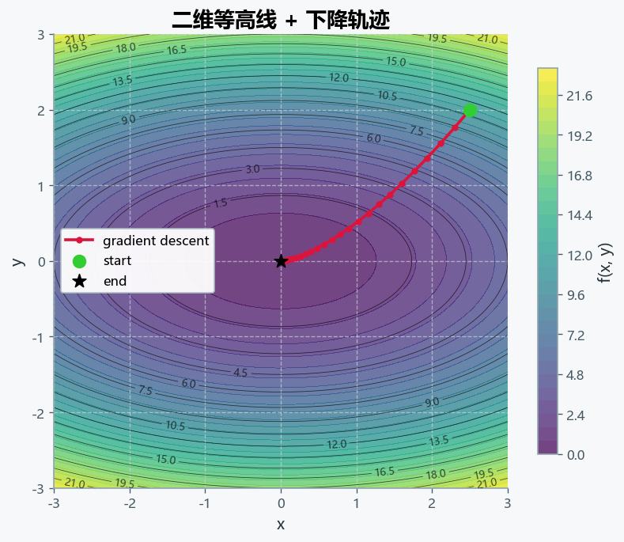

---

## 12. 三维曲面：add_surface()

### 12.1 坐标格式

x、y、z 支持两种形式：

~~~python
# 一维坐标 + 二维 z
x = np.linspace(-3, 3, 200)
y = np.linspace(-3, 3, 200)
X, Y = np.meshgrid(x, y)
Z = X**2 + Y**2
plotter.add_surface(x, y, Z, subplot=0)

# 或者直接传入二维网格
plotter.add_surface(X, Y, Z, subplot=0)
~~~

要求：

~~~text
z.shape == (len(y), len(x))
或者
X.shape == Y.shape == Z.shape
~~~

### 12.2 基本使用

~~~python
plotter.add_surface(
    X,
    Y,
    Z,
    subplot=0,
    title="三维曲面",
    xlabel="X",
    ylabel="Y",
    zlabel="f(X, Y)",
    cmap="turbo",
    edgecolor="none",
    alpha=0.92,
)
~~~

| 参数 | 默认值 | 说明 |
| --- | --- | --- |
| `x`、`y`、`z` | 必填 | 坐标与高度 |
| `subplot` | 0 | 子图序号 |
| `label`、`legend` | None、False | 图例文字与开关 |
| `colorbar` | False | 是否添加颜色条 |
| `colorbar_kwargs` | None | 传给 `fig.colorbar()` |
| `light_enhance` | None | 光照增强，`True` 或字典 |
| `view` | None | 三维视角配置 |
| `**kwargs` | — | 继续传给 `ax.plot_surface()` |

### 12.3 光照增强

~~~python
plotter.add_surface(X, Y, Z, subplot=0, cmap="turbo", light_enhance=True)
~~~

也可以传字典（推荐的完整写法）：

~~~python
plotter.add_surface(
    X, Y, Z,
    subplot=0,
    cmap="turbo",
    light_enhance={
        "azdeg": 315,        # 光源水平角度
        "altdeg": 55,        # 光源高度角度
        "gamma": 0.65,       # 颜色非线性增强
        "vert_exag": 1.8,    # 坡度视觉夸张程度
        "blend_mode": "soft",
        "vmin": np.percentile(Z, 2),
        "vmax": np.percentile(Z, 98),
        "cmap": "turbo",     # 光照使用的颜色映射，可写字符串
    },
    colorbar=True,
    colorbar_kwargs={"shrink": 0.7, "pad": 0.1, "label": "f(X, Y)"},
    view={"elev": 35, "azim": -55, "box_aspect": (1, 1, 0.65)},
)
~~~

开启光照增强后，曲面的颜色来自光照结果，颜色条会使用对应的 `ScalarMappable`，
因此颜色和颜色条始终一致。

---

## 13. 三维曲线：add_line3d()

三维曲线通常用于梯度下降轨迹。x、y、z 长度必须相同。

~~~python
plotter.add_line3d(
    path_x,
    path_y,
    path_z,
    subplot=0,
    title="三维下降轨迹",
    xlabel="x",
    ylabel="y",
    zlabel="f(x, y)",
    color="crimson",
    linewidth=2.5,
    marker="o",
    markersize=4,
    label="gradient descent",
    legend=True,
    legend_kwargs={"loc": "upper left"},
)
~~~

其他参数会继续传给 `Axes3D.plot()`，例如 `linestyle`、`alpha`、`markersize`。

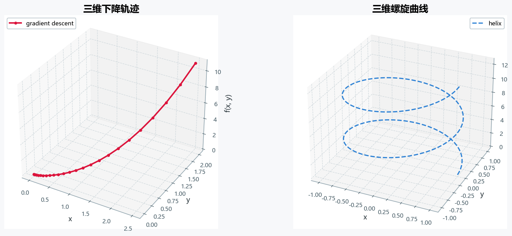

---

## 14. 三维散点：add_scatter3d()

x、y、z 可以是单个标量，也可以是长度相同的一维数组。

~~~python
# 起点
plotter.add_scatter3d(
    path_x[0], path_y[0], path_z[0],
    subplot=0,
    color="limegreen",
    s=90,
    marker="o",
    depthshade=False,
    label="start",
    legend=True,
)

# 终点
plotter.add_scatter3d(
    path_x[-1], path_y[-1], path_z[-1],
    subplot=0,
    color="black",
    s=110,
    marker="*",
    depthshade=False,
    label="end",
    legend=True,
)
~~~

也可以传入数组并让颜色跟随数值：

~~~python
plotter.add_scatter3d(
    x, y, z,
    subplot=0,
    c=z,
    cmap="viridis",
    s=26,
    alpha=0.85,
    depthshade=True,
)
~~~

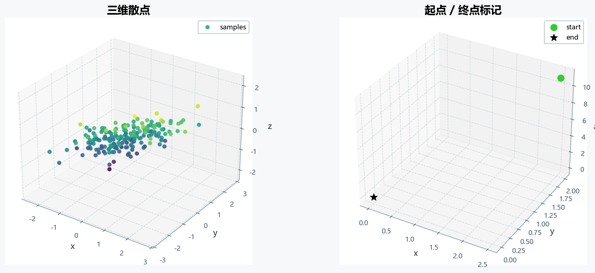

### 14.1 让三维曲线/散点压在曲面之上

三维的遮挡关系由「谁后画」决定，`Axes3D` 并不按 z 值做真正的深度排序。
轨迹（`line3d`）和起止点（`scatter3d`）经常落在曲面背后而被挡住，
表现为「轨迹几乎看不见」。

本类的两个方法已经内置了较大的默认 zorder：

~~~text
add_line3d()     -> highlight_zorder=100
add_scatter3d()  -> highlight_zorder=101   （保证起止点画在轨迹之上）
~~~

所以正常情况下轨迹会浮在曲面之上。如果仍然觉得不够醒目，
可以按下表逐级加强：

| 做法 | 写法 | 效果 |
| --- | --- | --- |
| 加大画线宽度 | `add_line3d(..., linewidth=4.0)` | 最有效，轨迹变粗 |
| 曲面对比 | `add_surface(..., alpha=0.75)` | 曲面半透明，轨迹透出来 |
| 自定义层级 | `add_line3d(..., highlight_zorder=200)` | 需要盖住其他图层时 |
| 轨迹抬高 | `add_line3d(px, py, pz + 0.05 * np.ptp(pz))` | 沿 z 轴上移一点，视觉上脱离曲面 |

例如完整的组合写法：

~~~python
plotter.add_surface(
    X, Y, Z, subplot=0, cmap="turbo", edgecolor="none",
    alpha=0.78,                     # 稍微透明，轨迹更容易看清
    view={"elev": 32, "azim": -60, "box_aspect": (1, 1, 0.8),
          "xlim": (-3, 3), "ylim": (-3, 3), "zlim": (0, 22)},
)
plotter.add_line3d(
    path_x, path_y, path_z, subplot=0,
    color="crimson", linewidth=4.0, marker="o", markersize=4,
    highlight_zorder=120,           # 显式指定，压住曲面
    label="gradient descent", legend=True,
    legend_kwargs={"loc": "upper left"},
)
~~~

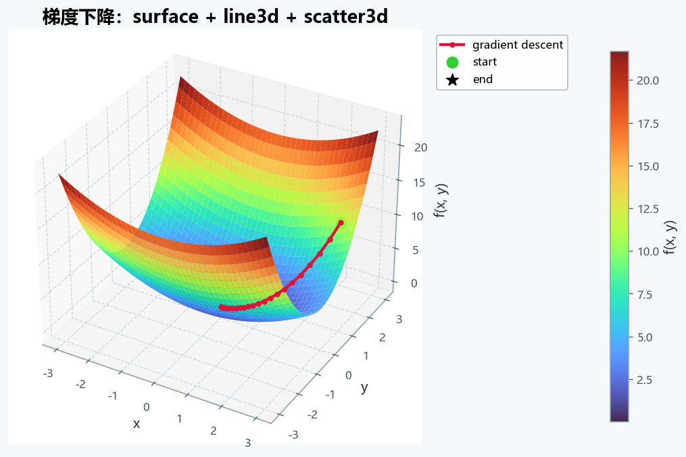

---

## 15. 三维柱状图：add_bar3d()

~~~python
x = np.array([0, 1, 2, 3, 0, 1, 2, 3])
y = np.array([0, 0, 0, 0, 1, 1, 1, 1])
z = np.zeros(8)
height = np.array([12.0, 48.0, 21.0, 6.5, 33.0, 9.0, 54.0, 15.0])

plotter.add_bar3d(
    x, y, z,
    dx=0.7,
    dy=0.7,
    dz=height,
    subplot=0,
    title="三维柱状图",
    xlabel="x",
    ylabel="y",
    zlabel="value",
    color="steelblue",
    edgecolor="black",
    linewidth=0.5,
    alpha=0.88,
)
~~~

参数：

| 参数 | 说明 |
| --- | --- |
| `x`、`y`、`z` | 每根柱子的起始坐标 |
| `dx` | x 方向宽度 |
| `dy` | y 方向宽度 |
| `dz` | 柱子高度 |

`dx`、`dy`、`dz` 可以是标量、长度为 1 的数组，或与柱子数量相同的一维数组。

柱顶数值标注见[第 17 节](#17-选择性数值标注)。

---

## 16. 三维直方图：add_hist3d()

`add_hist3d()` 接收二维样本 x、y，先用 `numpy.histogram2d()` 统计每个网格的
样本数量，再用三维柱状图显示；高度为 0 的网格不会绘制。

~~~python
rng = np.random.default_rng(42)

sample_x = rng.normal(0, 1, 3000)
sample_y = rng.normal(0, 1.4, 3000)

plotter.add_hist3d(
    sample_x,
    sample_y,
    bins=(20, 20),
    subplot=0,
    title="三维直方图",
    xlabel="sample x",
    ylabel="sample y",
    zlabel="count",
    cmap="viridis",
    edgecolor="black",
    linewidth=0.2,
    alpha=0.9,
)
~~~

| 参数 | 默认值 | 说明 |
| --- | --- | --- |
| `x`、`y` | 必填 | 二维样本，长度必须一致 |
| `bins` | 10 | 分箱数，可以是整数或 `(nx, ny)` |
| `range` | None | 统计范围 |
| `cmap` | viridis | 不传 `color` 时按柱高自动着色使用 |
| `color` | None | 传入后所有柱子使用统一颜色 |
| `**kwargs` | — | 继续传给 `ax.bar3d()` |

不传 `color` 时柱子按高度使用 `cmap` 自动着色；传入 `color` 时所有柱子颜色统一：

~~~python
plotter.add_hist3d(
    sample_x,
    sample_y,
    bins=(16, 16),
    subplot=0,
    color="steelblue",
    edgecolor="black",
    view={"elev": 30, "azim": -60, "box_aspect": (1, 1, 0.7)},
)
~~~

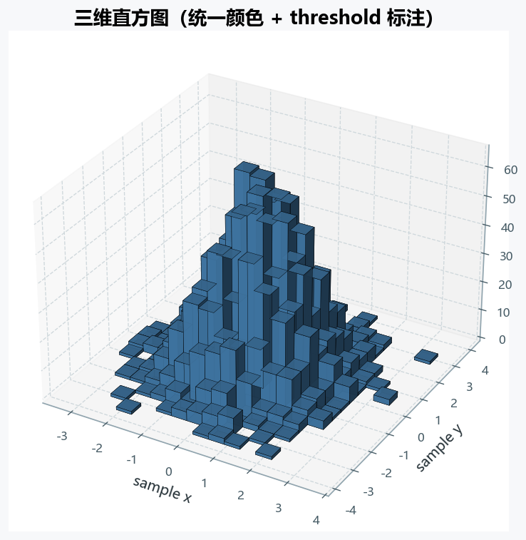

---

## 17. 选择性数值标注

三维柱状图（`add_bar3d`）和三维直方图（`add_hist3d`）的柱顶数值已经改为
**选择性标注**：不再一次性把所有柱子的数值都写出来，而是可以自动挑出最重要的柱子，
避免三维直方图那种“文字糊成一团”的情况。

### 17.1 标注参数

| 参数 | 默认值 | 说明 |
| --- | --- | --- |
| `show_values` | False | 是否开启柱顶数值，`False` 时完全不标注 |
| `value_selection` | `"auto"` | 选择策略：`auto` / `all` / `top` / `extrema` / `threshold` / `none` |
| `max_value_labels` | 20 | 最多标注多少个柱子（`auto`、`top` 使用） |
| `value_threshold` | None | `value_selection="threshold"` 时的阈值 |
| `value_format` | ".2f"（bar3d） ".0f"（hist3d） | 数值格式 |
| `value_offset` | 0.03 | 标签相对柱高的偏移比例 |
| `value_kwargs` | None | 标签文字样式，例如 `fontsize`、`color` |

`value_selection` 的六种取值：

| 取值 | 效果 |
| --- | --- |
| `"all"` | 标注所有柱子（旧行为，柱子多时会严重重叠） |
| `"auto"` | 默认值。柱子数量不超过 `max_value_labels` 时全部标注，超过时自动只标注最高的若干根，并额外保证最大值和最小值被标注 |
| `"top"` | 只标注绝对值最大的 `max_value_labels` 根柱子 |
| `"extrema"` | 只标注最大值和最小值两根柱子 |
| `"threshold"` | 只标注满足 `abs(value) >= value_threshold` 的柱子，必须同时给出 `value_threshold` |
| `"none"` | 不标注（等同于 `show_values=False`） |

`value_offset` 是按柱高范围的比例计算的：标签高度 = 柱子高度 + `value_offset × 柱高范围`，
所以柱高差异很大时仍然能保持合适的间距。

### 17.2 三维柱状图示例

~~~python
x = np.array([0, 1, 2, 3, 0, 1, 2, 3])
y = np.array([0, 0, 0, 0, 1, 1, 1, 1])
z = np.zeros(8)
height = np.array([12.0, 48.0, 21.0, 6.5, 33.0, 9.0, 54.0, 15.0])

# 全部标注
plotter.add_bar3d(
    x, y, z, dx=0.7, dy=0.7, dz=height,
    subplot=0,
    title="value_selection='all'：全部标注",
    show_values=True,
    value_selection="all",
    value_format=".0f",
    value_offset=0.02,
    value_kwargs={"fontsize": 8},
    color="steelblue", edgecolor="black",
    view={"elev": 26, "azim": -58, "box_aspect": (1, 1, 0.85)},
)

# 自动只标重点
plotter.add_bar3d(
    x, y, z, dx=0.7, dy=0.7, dz=height,
    subplot=1,
    title="value_selection='auto'：只标重点",
    show_values=True,
    value_selection="auto",
    max_value_labels=3,
    value_format=".0f",
    value_offset=0.02,
    value_kwargs={"fontsize": 8},
    color="steelblue", edgecolor="black",
    view={"elev": 26, "azim": -58, "box_aspect": (1, 1, 0.85)},
)
~~~

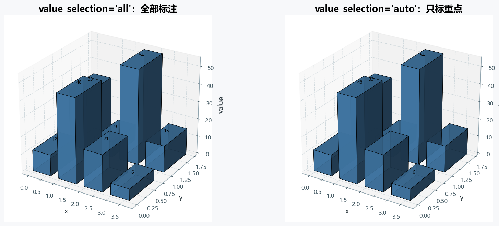

### 17.3 三维直方图示例

三维直方图柱子很多，默认的 `auto` 会自动限制标注数量：

~~~python
rng = np.random.default_rng(42)
sample_x = rng.normal(0, 1, 4000)
sample_y = rng.normal(0, 1.4, 4000)

common = dict(
    x=sample_x, y=sample_y, bins=(20, 20),
    xlabel="sample x", ylabel="sample y", zlabel="count",
    cmap="viridis", edgecolor="black", linewidth=0.2, alpha=0.9,
    value_kwargs={"fontsize": 6},
    view={"elev": 30, "azim": -60, "box_aspect": (1, 1, 0.7)},
)

# 全部标注：文字严重重叠
plotter.add_hist3d(
    subplot=0,
    title="value_selection='all'：文字严重重叠",
    show_values=True,
    value_selection="all",
    value_format=".0f",
    **common,
)

# 只标注 12 根最高的柱子
plotter.add_hist3d(
    subplot=1,
    title="value_selection='auto'：只标 12 根高柱",
    show_values=True,
    value_selection="auto",
    max_value_labels=12,
    value_format=".0f",
    value_offset=0.04,
    **common,
)
~~~

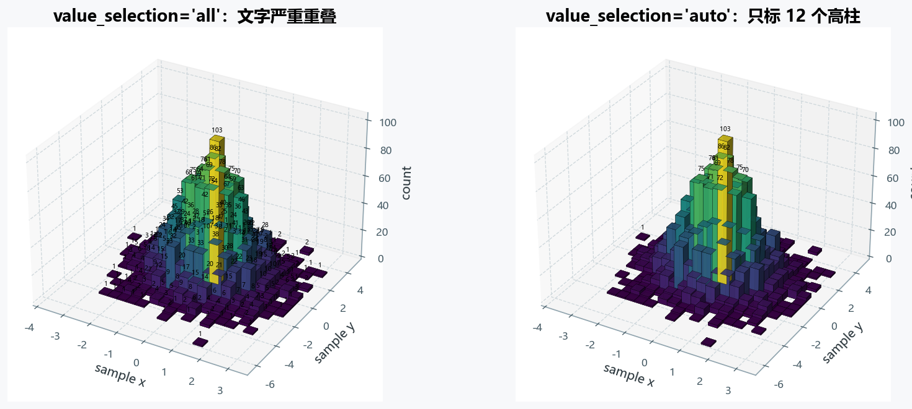

只标注超过阈值的柱子：

~~~python
plotter.add_hist3d(
    sample_x, sample_y, bins=(16, 16),
    subplot=0,
    show_values=True,
    value_selection="threshold",
    value_threshold=120,        # 只标注计数 >= 120 的网格
    value_format=".0f",
    value_offset=0.05,
    value_kwargs={"fontsize": 8},
)
~~~

只标注最大值和最小值：

~~~python
plotter.add_bar3d(
    x, y, z, dx=0.7, dy=0.7, dz=height,
    subplot=0,
    show_values=True,
    value_selection="extrema",
    value_format=".0f",
)
~~~

### 17.4 二维柱状图 / 直方图的数值标注

二维 `bar` 和 `hist` 仍然使用 `show_values=True` 显示全部数值，
参数为 `value_format`、`value_offset`（像素）、`value_kwargs`，
见[第 6 节](#6-二维柱状图与柱顶数值)和[第 7 节](#7-二维直方图与柱顶数值)。

---

## 18. 同一个子图混排多种图层

`MultiPlotter` 的一个子图里可以按调用顺序叠加多个同维度图层，
后添加的图层画在上面（也可以用 `zorder` 精确控制）。

### 18.1 二维：scatter + line（线性回归与 R²）

下面在同一个子图里先画散点、再画回归直线，就得到常见的回归拟合图；
旁边用 `line + scatter` 画残差图，用来说明 R² 的含义：

~~~python
x = np.linspace(0, 10, 40)
y = 2.4 * x + 1.6 + rng.normal(0, 1.8, x.size)
slope, intercept = np.polyfit(x, y, 1)
y_fit = slope * x + intercept
r2 = 1 - np.sum((y - y_fit) ** 2) / np.sum((y - y.mean()) ** 2)

# 子图 0：scatter（观测样本）+ line（回归直线）
plotter.add_plot(
    kind="scatter", x=x, y=y, subplot=0,
    color="#E64A19", s=34, alpha=0.75,
    label="观测样本", legend=True,
)
plotter.add_plot(
    kind="line", x=x, y=y_fit, subplot=0,
    title=f"线性回归：scatter + line（R²={r2:.3f}）",
    xlabel="x", ylabel="y",
    color="#1976D2", linewidth=2.4,
    label="回归直线", legend=True,
    legend_kwargs={"loc": "upper left"},
)

# 子图 1：line（零残差基线）+ scatter（残差）
plotter.add_plot(
    kind="line", x=[0, 10], y=[0, 0], subplot=1,
    title="R² 视角：line + scatter（残差图）",
    xlabel="x", ylabel="残差",
    color="#90A4AE", linewidth=1.4, linestyle="--",
    label="零残差基线", legend=True,
)
plotter.add_plot(
    kind="scatter", x=x, y=y - y_fit, subplot=1,
    color="#388E3C", s=30, alpha=0.8,
    label="残差", legend=True,
    legend_kwargs={"loc": "upper right"},
)
~~~

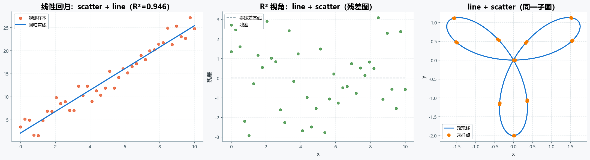

要点：

- 同一个子图的公共标题、坐标轴标签取**第一个非空配置**，所以只需要在其中一个图层里写
  `title`、`xlabel`、`ylabel`；
- 图例取第一个 `legend=True` 且带 `label` 的图层，因此不同图层的 `legend_kwargs`
  也以第一个为准；
- 想要谁画在上面，可以用 `zorder`，例如把轨迹设为 `zorder=5`、起点终点设为 `zorder=6`。

### 18.2 三维：surface + line3d + scatter3d（梯度下降）

同一个三维子图里同时叠加曲面、下降轨迹和起止点，就是典型的损失函数下降示意图：

~~~python
def surface_function(x, y):
    return 0.5 * x**2 + 2.0 * y**2

X, Y = np.meshgrid(np.linspace(-3, 3, 160), np.linspace(-3, 3, 160))
Z = surface_function(X, Y)
path_x, path_y = np.linspace(2.5, 0, 26), np.linspace(2.0, 0, 26)
path_z = surface_function(path_x, path_y)

plotter = MultiPlotter(ncols=1, figsize_per_plot=(8.4, 6.6), dpi=120)

# 1) 曲面
plotter.add_surface(
    X, Y, Z, subplot=0,
    title="梯度下降：surface + line3d + scatter3d",
    xlabel="x", ylabel="y", zlabel="f(x, y)",
    cmap="turbo", edgecolor="none", alpha=0.9,
    colorbar=True,
    colorbar_kwargs={"shrink": 0.7, "pad": 0.1, "label": "f(x, y)"},
    view={"elev": 32, "azim": -60, "box_aspect": (1, 1, 0.8)},
)

# 2) 下降轨迹
plotter.add_line3d(
    path_x, path_y, path_z, subplot=0,
    color="crimson", linewidth=2.6, marker="o", markersize=4,
    label="gradient descent", legend=True,
    legend_kwargs={"loc": "upper left", "bbox_to_anchor": (1.02, 1.0)},
)

# 3) 起点与终点
plotter.add_scatter3d(
    path_x[0], path_y[0], path_z[0], subplot=0,
    color="limegreen", s=95, marker="o", depthshade=False,
    label="start", legend=True,
)
plotter.add_scatter3d(
    path_x[-1], path_y[-1], path_z[-1], subplot=0,
    color="black", s=120, marker="*", depthshade=False,
    label="end", legend=True,
)
~~~

二维子图里也可以做同样的混排，用等高线 + 轨迹表示同一个下降过程：

~~~python
plotter.add_contour(X, Y, Z, subplot=1, levels=30, line_levels=15,
                    cmap="viridis", clabel=True,
                    view={"aspect": "equal"})
plotter.add_plot(kind="line", x=path_x, y=path_y, subplot=1,
                 color="crimson", linewidth=2.2, marker="o",
                 label="gradient descent", legend=True, zorder=5)
plotter.add_plot(kind="scatter", x=path_x[0], y=path_y[0], subplot=1,
                 color="limegreen", s=90, label="start",
                 legend=True, zorder=6)
plotter.add_plot(kind="scatter", x=path_x[-1], y=path_y[-1], subplot=1,
                 color="black", s=110, marker="*", label="end",
                 legend=True, zorder=6)
~~~

---

## 19. 矢量场：二维与三维

矢量场用「箭头 + 流线」两种方式表达：

| 方法 | 维度 | 底层调用 | 适合展示 |
| --- | --- | --- | --- |
| `add_quiver()` | 二维 | `Axes.quiver()` | 每一点的矢量大小和方向 |
| `add_streamplot()` | 二维 | `Axes.streamplot()` | 流线、漩涡、分离与再附 |
| `add_quiver3d()` | 三维 | `Axes3D.quiver()` | 三维空间中的矢量分布 |
| `add_stream3d()` | 三维 | 自研 RK4 积分 + `Axes3D.plot()` | 三维流线、螺旋、磁力线 |

二维矢量场的坐标写法与 `add_surface` 一致：

~~~text
x、y 是一维坐标  -> 自动 meshgrid，u、v 形状必须是 (len(y), len(x))
x、y 是二维网格  -> u、v 形状必须与 x、y 完全一致
~~~

### 19.1 二维箭头：add_quiver()

~~~python
plotter.add_quiver(
    X, Y, U, V,
    subplot=0,
    title="二维涡旋速度场",
    xlabel="x", ylabel="y",
    scale=16,                   # 数值越小箭头越长；None 表示自动
    cmap="turbo",               # 按模长着色时使用的颜色映射
    color_by_magnitude=True,    # True：颜色表示 |V|；False：用固定颜色
    color=None,                 # color_by_magnitude=False 时的固定颜色
    colorbar=True,
    colorbar_kwargs={"label": "|V|", "shrink": 0.85},
    pivot="tail",               # 箭头绕 tail / middle / tip 旋转
    view={"xlim": (-2, 2), "ylim": (-2, 2), "aspect": "equal"},
    width=0.004,                # 透传给 ax.quiver()，即箭头杆宽
)
~~~

参数说明：

| 参数 | 默认值 | 说明 |
| --- | --- | --- |
| `x`、`y` | 必填 | 坐标，一维轴或二维网格 |
| `u`、`v` | 必填 | 矢量分量，形状见上面的规则 |
| `scale` | None | 箭头长度缩放。数值越小箭头越长；None 交给 matplotlib 自动 |
| `color_by_magnitude` | True | True 时用颜色表示模长，False 时用固定颜色 |
| `color` | None | 固定颜色，只在 `color_by_magnitude=False` 时使用 |
| `cmap` | "viridis" | 按模长着色时的颜色映射 |
| `colorbar`、`colorbar_kwargs` | False、None | 颜色条设置 |
| `pivot` | "tail" | 箭头围绕哪个点旋转 |
| `axis`、`view` | "equal"、None | 坐标轴比例与范围 |
| `**kwargs` | — | 与 Matplotlib 一致，例如 `width`、`headwidth`、`headlength`、`alpha` |

`color` 和 `color_by_magnitude=True` 同时出现会直接报错，避免颜色被静默忽略。

### 19.2 二维流线：add_streamplot()

~~~python
plotter.add_streamplot(
    X, Y, U, V,
    subplot=1,
    title="同一流场的流线",
    xlabel="x", ylabel="y",
    density=1.6,                # 流线密度，也可以给 (density_x, density_y)
    line_width=1.3,             # 流线线宽
    cmap="turbo",               # 按速度着色
    arrowsize=1.1,              # 箭头大小
    arrowstyle="-|>",           # 箭头样式
    maxlength=4.0,              # 单条流线最大长度（坐标轴单位）
    integration_direction="both",   # both / forward / backward
    broken_streamlines=True,    # 遇到停滞区是否断开流线
    colorbar=True,
    colorbar_kwargs={"label": "|V|"},
    view={"xlim": (-2, 2), "ylim": (-2, 2), "aspect": "equal"},
)
~~~

参数说明：

| 参数 | 默认值 | 说明 |
| --- | --- | --- |
| `density` | 1.2 | 流线密度。标量或 `(x, y)`；网格越密，实际线条越多 |
| `line_width` | 1.4 | 流线线宽，也可以传数组按流线分别指定 |
| `color_by_magnitude` | True | 按速度着色；False 时用 `color` |
| `arrowsize`、`arrowstyle` | 1.2、`-&#124;>` | 流线箭头大小与样式 |
| `maxlength` | 4.0 | 单条流线最大长度 |
| `integration_direction` | "both" | 积分方向 |
| `broken_streamlines` | True | 停滞区是否断开。低版本 matplotlib 会自动忽略此项 |

### 19.3 三维箭头：add_quiver3d()

~~~python
plotter.add_quiver3d(
    X, Y, Z, U, V, W,
    subplot=0,
    title="三维矢量场",
    xlabel="x", ylabel="y", zlabel="z",
    density=11,          # 抽稀：每轴大约保留多少个箭头
    length=0.45,         # 箭头长度
    normalize=True,      # 是否把所有箭头归一化到同一长度
    cmap="turbo",
    colorbar=True,
    colorbar_kwargs={"label": "|V|"},
    view={"xlim": (-2, 2), "ylim": (-2, 2), "zlim": (-1.5, 1.5),
          "elev": 22, "azim": -58},
)
~~~

| 参数 | 默认值 | 说明 |
| --- | --- | --- |
| `x`、`y`、`z` | 必填 | 一维轴或三维网格 |
| `u`、`v`、`w` | 必填 | 三分量，形状见 18.5 的舍入规则 |
| `density` | 18 | 抽稀密度。`21×21×15` 的网格给 11，箭头就比较清爽 |
| `length` | 0.8 | 箭头长度 |
| `normalize` | True | True 时箭头等长，长度不再携带信息 |
| `arrow_length_ratio` | 0.3 | 箭头头部占整条箭头的比例 |
| `color_by_magnitude`、`cmap` | True、"viridis" | 按模长着色 |

### 19.4 三维流线：add_stream3d()

三维流线没有现成的 matplotlib 接口，本方法用**四阶龙格-库塔法（RK4）**
对矢量场做数值积分，得到空间中的轨迹线。

~~~python
def vortex(x, y, z):
    """矢量场的解析表达式，返回 (u, v, w)。"""
    return (-y, x, 0.4)

plotter.add_stream3d(
    X, Y, Z, U, V, W,
    subplot=1,
    title="三维流线（RK4 积分）",
    xlabel="x", ylabel="y", zlabel="z",
    field_func=vortex,      # 必须提供：积分用的解析场函数
    n_seeds=9,              # 自动撒 9 个起点
    seed_radius=0.55,       # 起点分布在中心球面的 0~seed_radius 半径内
    step_size=0.05,         # 积分步长
    max_steps=500,          # 单条流线最多 500 步
    both_directions=True,   # 正反双向积分再拼接
    line_width=2.0,
    cmap="turbo",
    color_by_speed=True,    # 按流线各点速度着色
    color=None,             # color_by_speed=False 时的固定颜色
    colorbar=True,
    colorbar_kwargs={"label": "|V|"},
    seed=0,                 # 自动撒点的随机种子，保证可复现
    view={"xlim": (-2, 2), "ylim": (-2, 2), "zlim": (-1.5, 1.5)},
)
~~~

也可以用 `seeds=[(x, y, z), ...]` 手动指定起点，此时忽略 `n_seeds` / `seed_radius`：

~~~python
plotter.add_stream3d(
    X, Y, Z, U, V, W,
    subplot=0,
    field_func=vortex,
    seeds=[(1.0, 0.0, -1.0), (0.0, 1.0, 1.0), (-1.0, 0.0, 0.0)],
    color="#C62828", color_by_speed=False,   # 固定颜色
    view={"xlim": (-2, 2), "ylim": (-2, 2), "zlim": (-1.5, 1.5)},
)
~~~

参数说明：

| 参数 | 默认值 | 说明 |
| --- | --- | --- |
| `field_func` | None | **必填**：`field_func(x, y, z) -> (u, v, w)`，用于 RK4 积分 |
| `seeds` | None | 手动起点 `(n, 3)`；给了它就忽略 `n_seeds` / `seed_radius` |
| `n_seeds` | 8 | 自动撒点数量 |
| `seed_radius` | 0.6 | 自动撒点时，起点到中心的距离比例（0~1，相对于半边长） |
| `step_size` | 0.04 | 积分步长。太大容易跨出边界，太小则步数不够 |
| `max_steps` | 600 | 单条流线最大步数 |
| `both_directions` | True | 是否正反双向积分 |
| `line_width` | 2.0 | 流线线宽 |
| `color_by_speed` | True | 按速度着色；False 时用 `color` |
| `seed` | 0 | 自动撒点的随机种子 |

三点使用提醒：

- 积分需要**解析表达式**。只有离散网格数据时请用 `add_quiver3d()`；
- `x`、`y`、`z` 网格只用来确定域边界，不参与插值；
- 起点正好落在驻点（速度为 0）时该条流线会被自动跳过；
  如果所有流线都被跳过，会抛出带排查建议的 `ValueError`。

### 19.5 三维场的形状约定

`u`、`v`、`w` 的**第三个下标必须是 z**。当 `x`、`y`、`z` 传一维轴时，
下面两种形状都支持，会自动识别：

~~~text
np.meshgrid(x, y, z, indexing="ij")  ->  (len(x), len(y), len(z))
np.meshgrid(x, y, z, indexing="xy")  ->  (len(y), len(x), len(z))
~~~

第三种形状（把 z 放到第一个下标）会直接报错，并提示实际形状与两种合法形状。
三个轴长度恰好相同时无法自动判断，会打印一条提示并按 `ij` 处理。

### 19.6 运行结果：二维涡旋速度场与流线

Lamb–Oseen 涡的速度场：

~~~python
def vortex_2d(x, y, strength=1.0, core=0.35):
    radius_sq = x ** 2 + y ** 2 + 1e-12
    factor = (1.0 - np.exp(-radius_sq / core ** 2)) / radius_sq
    return -strength * y * factor, strength * x * factor
~~~

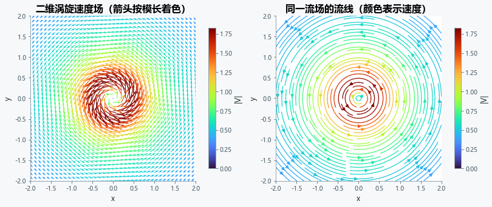

左图是箭头（颜色表示速度模长），右图是同一流场的流线。
两张图都用了 `view={"aspect": "equal"}`，保证圆圈不被拉成椭圆。

### 19.7 运行结果：二维有限元张量场

对上面的速度场求梯度，得到速度梯度张量（雅可比矩阵）

~~~text
J = [[du/dx, du/dy],
     [dv/dx, dv/dy]]
~~~

小变形张量取它的对称部分 `ε = (J + Jᵀ) / 2`，反对称部分对应旋转。
对称张量 `[[εxx, εxy], [εxy, -εxx]]` 的主轴方向（特征向量）可以用
`2θ = atan2(2εxy, 2εxx)` 直接算出来：

~~~python
import numpy as np

# 速度梯度张量分量（解析解，见 generate_field_examples.py）
du_dx, du_dy, dv_dx, dv_dy = vortex_velocity_gradient(X, Y)

strain_xx = du_dx                     # εxx
strain_xy = 0.5 * (du_dy + dv_dx)     # εxy

# 主轴方向（特征向量）
theta = 0.5 * np.arctan2(2.0 * strain_xy, 2.0 * strain_xx)
principal_x, principal_y = np.cos(theta), np.sin(theta)
~~~

~~~python
# 左：正应变云图 + 剪应变等值线
plotter.add_contour(
    X, Y, strain_xx, subplot=0,
    title="正应变 εxx 云图 + 剪应变 εxy 等值线",
    xlabel="x", ylabel="y",
    levels=24, line_levels=9, cmap="RdBu_r",
    filled=True, alpha=0.85,
    clabel=True,
    clabel_kwargs={"inline": True, "fontsize": 6.5, "fmt": "%.1f"},
    colorbar=True,
    colorbar_kwargs={"label": "εxx"},
    contour_kwargs={"colors": "#263238", "linewidths": 0.7},
    view={"xlim": (-2, 2), "ylim": (-2, 2), "aspect": "equal"},
)

# 右：主轴方向场
plotter.add_quiver(
    X, Y, principal_x, principal_y, subplot=1,
    title="张量主轴方向场（每点的特征向量）",
    xlabel="x", ylabel="y",
    scale=24, color="#37474F", color_by_magnitude=False,
    view={"xlim": (-2, 2), "ylim": (-2, 2), "aspect": "equal"},
)
~~~

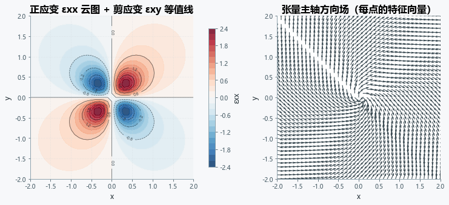

> 提示：`kind="heatmap"` 用的是矩阵下标坐标系，不认物理坐标。
> 如果张量是在物理网格上算的，要么用 `add_contour()`（它接受 X、Y），
> 要么用 `tick_labels` 把刻度换成物理坐标。

### 19.8 运行结果：三维矢量场与流线

~~~python
plotter.add_quiver3d(
    X, Y, Z, U, V, W, subplot=0,
    title="三维矢量场（箭头按模长着色）",
    density=11, length=0.45, cmap="turbo", colorbar=True,
    view={"xlim": (-2, 2), "ylim": (-2, 2), "zlim": (-1.5, 1.5),
          "elev": 22, "azim": -58},
)
plotter.add_stream3d(
    X, Y, Z, U, V, W, subplot=1,
    title="同一场的三维流线（RK4 积分）",
    field_func=vortex, n_seeds=9, seed_radius=0.55,
    step_size=0.05, max_steps=500,
    color="#C62828", color_by_speed=False,   # 绕涡轴速度几乎相同，用固定色更清楚
    view={"xlim": (-2, 2), "ylim": (-2, 2), "zlim": (-1.5, 1.5),
          "elev": 22, "azim": -58},
)
~~~

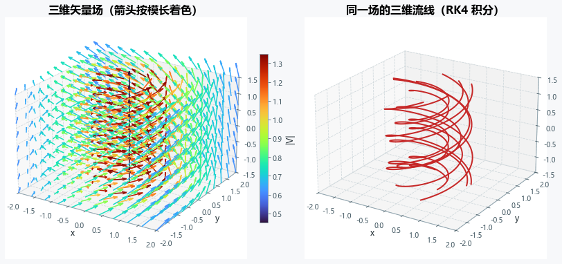

### 19.9 矢量场动画

> **先看这条坑**：流线动画要求流场本身**真的随时间变化**。
> 单个高斯涡（Lamb–Oseen）是旋转对称的，把速度场绕原点旋转任意角度，
> 得到的还是同一个场（`|V|` 差异只有 1e-16 量级），流线在数学上完全不变，
> 动画会看起来像一张静止图。这不是代码问题，是选错了演示用的流场。
> 下面用**双涡对**，它的涡核位置随时间改变，流线形态会明显变化。

**二维箭头**最快：`ax.quiver()` 返回的 `Quiver` 支持 `set_UVC()` 原地更新。

~~~python
def vortex_pair(x, y, phase, orbit_radius=1.0, core=0.30, strength=1.0):
    """一对反号高斯涡绕共同中心旋转；涡核位置随 phase 改变。"""
    u = np.zeros_like(x, dtype=float)
    v = np.zeros_like(y, dtype=float)

    for sign in (1.0, -1.0):
        cx = sign * orbit_radius * np.cos(phase)   # 两个涡核关于原点对称
        cy = sign * orbit_radius * np.sin(phase)
        dx, dy = x - cx, y - cy
        radius_sq = dx ** 2 + dy ** 2 + 1e-9
        factor = (1.0 - np.exp(-radius_sq / core ** 2)) / radius_sq
        u += -sign * strength * dy * factor        # 环量相反
        v += sign * strength * dx * factor

    return u, v

plotter = AnimationPlotter(ncols=2, figsize_per_plot=(5.4, 4.4), dpi=85)

pair_u, pair_v = vortex_pair(X, Y, 0.0)
plotter.add_quiver(X, Y, pair_u, pair_v, subplot=0, scale=6, cmap="turbo",
                   view={"xlim": (-2, 2), "ylim": (-2, 2), "aspect": "equal"})
plotter.add_streamplot(X, Y, pair_u, pair_v, subplot=1, density=1.4,
                       line_width=1.2, cmap="turbo",
                       view={"xlim": (-2, 2), "ylim": (-2, 2),
                             "aspect": "equal"})
plotter.draw(show=False)

quiver_ax = plotter.get_axes(0)

def update(ax, frame):
    phase = np.deg2rad(frame * 18.0)
    qu, qv = vortex_pair(X, Y, phase)
    speed = np.hypot(qu, qv)

    if ax is quiver_ax:                            # 子图 0：箭头
        ax.quiver(X, Y, qu, qv, speed, cmap="turbo", scale=6, width=0.006)
        ax.set_title(f"双涡对（箭头，phase {frame * 18}°）")
    else:                                          # 子图 1：流线
        ax.streamplot(X, Y, qu, qv, density=1.4, color=speed,
                      cmap="turbo", linewidth=1.2, arrowsize=1.1)
        ax.set_title(f"同一时刻的流线（phase {frame * 18}°）")

    ax.set_xlim(-2, 2)
    ax.set_ylim(-2, 2)
    ax.set_aspect("equal")
    return ax,

plotter.animate(
    subplots=[0, 1],            # 两个子图都参与，框架会逐个调用 update
    frames=10, interval=160, blit=False, update_mode="reset",
    update_func=update, save_path="output/vector_2d.gif", fps=6,
)
~~~

两点关键：

1. **`subplots=[0, 1]` 时，`update` 会被调用两次**（每个子图一次），
   要靠 `ax is quiver_ax` 区分画什么。框架会在调用前先 `ax.clear()`，
   所以两个子图都必须重画；
2. **流线只能用 `reset` 模式**：`streamplot` 每次都会重建 `LineCollection`，
   不能像 `Quiver` 那样原地 `set_UVC`。

**三维矢量场**最简单的方式是转视点。注意 `reset` 模式会先清空坐标轴，
所以回调里必须把箭头和流线**一起重画**，只写 `view_init` 会得到一张空图：

~~~python
ax = plotter.get_axes(0)

# 先抽稀箭头：网格 21x21x15 全画会有 6000 多支，既卡又看不清
qx, qy, qz, qu, qv, qw = MultiPlotter._shrink_field(X, Y, Z, U, V, W,
                                                    density=10)
magnitudes = np.linalg.norm(np.column_stack([qu, qv, qw]), axis=1)
norm = Normalize(vmin=magnitudes.min(), vmax=magnitudes.max())
cmap_obj = plt.get_cmap("turbo")

def update(ax, frame):
    angle = -60 + frame * 18

    ax.clear()
    ax.quiver(qx, qy, qz, qu, qv, qw,
              colors=cmap_obj(norm(magnitudes)),
              length=0.45, normalize=True)           # 重画箭头

    for trajectory in streams:                       # 重画流线
        ax.plot(trajectory[:, 0], trajectory[:, 1], trajectory[:, 2],
                color="#E64A19", linewidth=2.6, zorder=100)

    ax.set_xlim(-2, 2); ax.set_ylim(-2, 2); ax.set_zlim(-1.5, 1.5)
    ax.set_xlabel("x"); ax.set_ylabel("y"); ax.set_zlabel("z")
    ax.view_init(elev=22, azim=angle)
    ax.set_box_aspect((1, 1, 0.65))
    ax.set_title(f"三维矢量场 + 流线（视点旋转 {frame * 18}°）")
    return ax,

plotter.animate(subplots=[0], frames=20, blit=False, update_mode="reset",
                update_func=update, save_path="output/vector_3d.gif", fps=7)
~~~

（`streams` 是预先用 `add_stream3d` 同一套 RK4 算法积好的流线列表，
逐帧复用，不必每帧重新积分。详见 `tests/generate_field_examples.py`。）

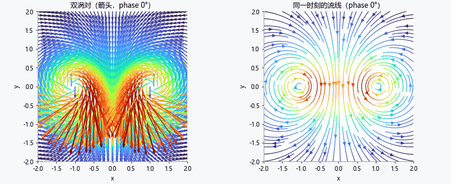

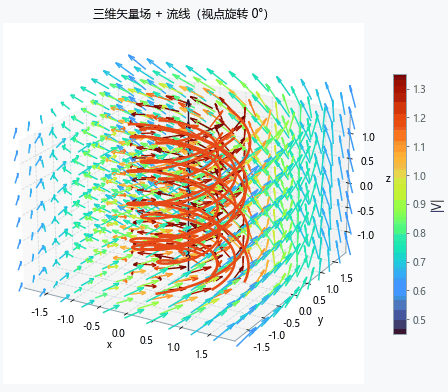

---

## 20. 二维表格：add_table()

`add_table()` 在坐标轴上画一张表格，适合把实验结果、指标对比直接放进图里。
底层是 `Axes.table()`，但把「表头 / 行标题 / 斑马纹 / 单元格配色 / 条件高亮」
都做成了参数，不用自己遍历 `table.get_celld()`。

### 20.1 最小示例

~~~python
data = [
    ["0.812", "0.873", "0.883", "+0.071"],
    ["0.774", "0.845", "0.856", "+0.082"],
]

plotter.add_table(
    data,
    subplot=0,
    title="模型对比",
    row_labels=["准确率", "召回率"],
    col_labels=["基线", "剪枝", "量化", "变化"],
    view={"xlim": (0.0, 1.0), "ylim": (0.0, 1.0)},
)
~~~

> 表格要配合 `view={"xlim": (0, 1), "ylim": (0, 1)}` 使用。
> 因为表格位置是用坐标轴坐标（0~1）表示的，固定范围后表格不会被裁掉；
> 做动画时这一条也是必须的。

### 20.2 完整参数

**数据相关：**

| 参数 | 默认值 | 说明 |
| --- | --- | --- |
| `cell_text` | 必填 | 二维列表/数组；一维列表按单列处理 |
| `row_labels` | None | 行标题，长度必须等于行数；None 时自动生成「行1、行2…」 |
| `col_labels` | None | 列标题，长度必须等于列数；None 时自动生成「列1、列2…」 |
| `show_values` | False | 是否把单元格里的数字重新格式化 |
| `value_format` | None | 格式化模板，例如 `".3f"`；给 `None` 时按原样显示 |

**布局相关：**

| 参数 | 默认值 | 说明 |
| --- | --- | --- |
| `loc` | "center" | 表格位置：center / upper left / lower right … |
| `bbox` | None | `[x, y, width, height]`，坐标轴坐标；给了它 `loc` 就失效 |
| `cell_align` | "center" | 单元格对齐：left / center / right |
| `cell_fontsize` | 10 | 单元格字号 |
| `cell_height` | 0.09 | 行高 |
| `col_width` | None | None 等宽；给序列表示各列宽度比例，内部会归一化 |
| `edge_color`、`edge_width` | "#90A4AE"、0.8 | 边框颜色与线宽 |
| `axis_off` | True | 是否隐藏坐标轴（表格一般不需要坐标轴） |

**配色相关：**

| 参数 | 默认值 | 说明 |
| --- | --- | --- |
| `background_color` | None | 单元格底色 |
| `text_color` | None | 单元格文字颜色 |
| `header_background`、`header_text_color` | "#1976D2"、"#FFFFFF" | 表头配色 |
| `header_fontsize`、`header_bold` | 同 `cell_fontsize`、True | 表头字号与加粗 |
| `row_label_background`、`row_label_text_color` | "#ECEFF1"、"#263238" | 行标题配色 |
| `row_label_bold` | True | 行标题加粗 |
| `zebra_color` | None | 斑马纹颜色，对奇数行生效 |
| `highlight_color`、`highlight_text_color`、`highlight_bold` | "#FFE082"、"#263238"、True | 高亮单元格样式 |

**颜色参数支持四种写法**（`background_color`、`text_color` 同理）：

~~~python
background_color="#FFFFFF"                    # 整表统一
background_color=["#E3F2FD", "#FFFDE7"]       # 按行（长度=行数）
background_color=["#E3F2FD", "#FFFDE7", "#E8F5E9", "#FFFFFF"]   # 按列（长度=列数）
background_color=[[...], [...]]               # 完整二维数组
~~~

### 20.3 单元格高亮

`highlight` 支持三种写法：

~~~python
highlight=(0, 3)                     # 单个单元格
highlight=[(0, 3), (1, 3), (2, 3)]   # 多个单元格
highlight={"<": 0.80}                # 条件：数值小于 0.80 的单元格
~~~

条件运算符支持 `>`、`>=`、`<`、`<=`、`==`、`!=`，只对能转成数字的单元格生效。
越界的单元格坐标或非法的运算符会直接报错。

### 20.4 斑马纹

~~~python
zebra_color="#F5F7F9"                                  # 奇数行
zebra_color={"rows": [0, 2, 4], "color": "#FFF3E0"}     # 指定行
~~~

### 20.5 运行结果

~~~python
plotter.add_table(
    data,
    subplot=0,
    title="模型压缩实验结果",
    row_labels=["准确率", "召回率", "F1", "参数量(M)", "推理耗时(ms)"],
    col_labels=["基线", "剪枝", "量化", "变化"],
    col_width=[1.0, 1.0, 1.0, 1.1],
    cell_align="center",
    cell_fontsize=11,
    cell_height=0.115,
    background_color="#FFFFFF",
    text_color="#263238",
    edge_color="#B0BEC5",
    edge_width=0.9,
    header_background="#1976D2",
    header_text_color="#FFFFFF",
    header_fontsize=11.5,
    row_label_background="#ECEFF1",
    row_label_text_color="#263238",
    zebra_color="#F5F7F9",
    highlight=[(0, 3), (1, 3), (2, 3), (3, 3), (4, 3)],   # 变化列整列高亮
    highlight_color="#C8E6C9",
    highlight_text_color="#1B5E20",
    highlight_bold=True,
    bbox=[0.02, 0.06, 0.96, 0.82],
    view={"xlim": (0.0, 1.0), "ylim": (0.0, 1.0)},
)
~~~

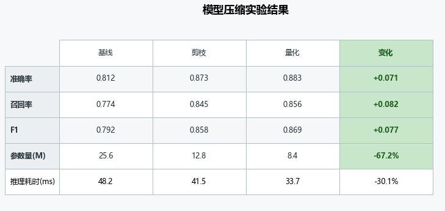

### 20.6 表格动画

`Table` 对象是持久的，可以直接 `set_text()` 更新文字：

~~~python
plotter = AnimationPlotter(ncols=1, figsize_per_plot=(5, 3), dpi=60)
plotter.add_table(
    TABLE_DATA, subplot=0, title="指标变化",
    col_labels=["指标", "数值"],
    view={"xlim": (0.0, 1.0), "ylim": (0.0, 1.0)},   # 表格动画必须固定范围
)
plotter.draw(show=False)

table = plotter.get_axes(0)._multiplotter_table_cache[0]

def update(ax, text):
    table.get_celld()[(0, 1)].get_text().set_text(str(text[0][1]))
    table.get_celld()[(1, 1)].get_text().set_text(str(text[1][1]))
    return table,

plotter.animate(
    frame_data={i: [[...], [...]] for i in range(6)},
    interval=300, blit=False, update_mode="append",
    update_func=update, save_path="output/table.gif", fps=3,
)
~~~

也可以让类自己更新：把新文本写进 `config["frame_text"]` 再调用 `_update_table(ax, config)`。

---

## 21. 三维视角和坐标比例

三维图层通过 `view` 字典控制：

~~~python
view_3d = {
    "elev": 35,               # 视角高度角
    "azim": -55,              # 视角方位角
    "roll": 0,                # 画布滚转角
    "box_aspect": (1, 1, 0.8),# 三维坐标轴显示比例
    "proj_type": "persp",     # persp 或 ortho
    "xlim": (-3, 3),
    "ylim": (-3, 3),
    "zlim": (-10, 20),
    "grid": True,
}
~~~

使用：

~~~python
plotter.add_surface(
    X, Y, Z,
    subplot=0,
    view={
        "elev": 35,
        "azim": -55,
        "box_aspect": (1, 1, 0.8),
        "proj_type": "ortho",
    },
)
~~~

同一个子图里只有第一个非空的 `view` 会生效。

二维图层也可以使用 `view`：

~~~python
view_2d = {
    "aspect": "equal",
    "xlim": (-3, 3),
    "ylim": (-3, 3),
    "grid": True,
}
~~~

也可以直接用 `axis="equal"` 设置比例。

---

## 22. 图例位置

图例默认由第一个 `legend=True` 且有 `label` 的图层控制。建议把图例放到坐标轴外，
避免遮挡曲面：

~~~python
legend_kwargs = {
    "loc": "upper left",
    "bbox_to_anchor": (1.03, 1.0),
    "borderaxespad": 0,
}

plotter.add_line3d(
    path_x, path_y, path_z,
    subplot=0,
    color="crimson",
    label="gradient descent",
    legend=True,
    legend_kwargs=legend_kwargs,
)
~~~

如果图例被裁剪，可以增大画布：

~~~python
plotter = MultiPlotter(
    ncols=1,
    figsize_per_plot=(10, 7),
    dpi=130,
)
~~~

---

## 23. add_layer() 统一入口

如果希望所有图层都通过 `kind` 添加，可以使用 `add_layer()`：

~~~python
plotter.add_layer(kind="surface", x=X, y=Y, z=Z, subplot=0, cmap="turbo")

plotter.add_layer(kind="line3d", x=path_x, y=path_y, z=path_z,
                  subplot=0, color="crimson", label="gradient descent")

plotter.add_layer(kind="contour", x=X, y=Y, z=Z, subplot=1,
                  levels=30, cmap="viridis")

plotter.add_layer(kind="line", x=path_x, y=path_y, subplot=1,
                  color="crimson", label="gradient descent")

plotter.add_layer(kind="pie", labels=["A", "B", "C"], values=[3, 2, 5], subplot=2)
~~~

### 23.1 支持的 kind

`add_layer()` 支持全部已注册的 kind：

| 维度 | kind |
| --- | --- |
| 二维 | `line`、`scatter`、`bar`、`hist`、`pie`、`heatmap`、`image`、`contour`、`quiver`、`streamplot`、`table` |
| 三维 | `surface`、`line3d`、`scatter3d`、`bar3d`、`hist3d`、`quiver3d`、`stream3d` |

~~~python
plotter.add_layer(kind="quiver", x=X, y=Y, u=U, v=V, subplot=0,
                  scale=16, cmap="turbo")

plotter.add_layer(kind="stream3d", x=X, y=Y, z=Z, u=U, v=V, w=W,
                  subplot=1, field_func=vortex, n_seeds=9)

plotter.add_layer(kind="table", cell_text=data, subplot=2,
                  col_labels=["指标", "基线", "改进"])
~~~

### 23.2 它是怎么分派的

`add_layer()` 不再是手写的 `if/elif` 链，而是查一张**注册表**：

~~~python
# multiplotter/registries.py
ADD_DISPATCH = {
    "surface": "add_surface",
    "contour": "add_contour",
    "table":   "add_table",
    "quiver":  "add_quiver",
    ...
}
~~~

这张表由 `KIND_DEFAULTS` 自动生成，所以：

- 每个 kind 的参数名与对应 `add_*` 方法完全一致；
- **新增图层只要注册一次**，`add_layer()` 自动支持，不用改这个方法。

~~~python
from multiplotter import MultiPlotter

def draw_step(ax, config):
    ax.step(config["x"], config["y"], where=config["where"])

MultiPlotter.register_layer(
    kind="step", dimension=2, add_method="add_step",
    draw_handler=draw_step, passthrough={"where"},
)

plotter.add_layer(kind="step", x=x, y=y, where="mid")   # 立即可用
~~~

### 23.3 普通二维图层的写法

`line` / `scatter` / `bar` / `hist` / `pie` / `heatmap` / `image`
也可以走 `add_layer()`，它内部会转发到 `add_plot(kind=...)`：

~~~python
plotter.add_layer(kind="scatter", x=x, y=y, subplot=0, s=40)
~~~

### 23.4 列出所有已注册图层

~~~python
from multiplotter import MultiPlotter

for spec in MultiPlotter.registered_layers():
    print(spec["kind"], spec["dimension"], spec["add_method"])

# 或者查单个
spec = MultiPlotter.get_layer_spec("surface")
print(spec.add_method, spec.dimension, sorted(spec.passthrough))
~~~

---

## 24. draw()、保存与 clear()

### 24.1 显示与返回

~~~python
plotter.draw(show=True)                 # 显示图像
fig, axes = plotter.draw(show=False)    # 只生成 Figure，不弹窗
~~~

`draw()` 返回 `(fig, axes)`，`axes` 是一个 `numpy.object_` 数组，按 subplot 序号排列。

### 24.2 保存图像：save_path

保存到指定路径（推荐）：

~~~python
plotter.draw(show=False, save_path="results/optimization_plot.png")
~~~

`save_path` 支持四种写法：

~~~python
plotter.draw(show=False, save_path="results/optimization_plot.png")  # 完整文件路径
plotter.draw(show=False, save_path="results/optimization_plot")      # 自动补 .png
plotter.draw(show=False, save_path="results/")                       # 目录 + 默认文件名
plotter.draw(show=False, save_path="results")                        # 已存在的目录，同上
~~~

说明：

- 传入 `save_path` 时**不需要**再传 `save=True`；
- 父目录不存在时会自动创建；
- 同名文件已存在时会自动加序号（`plot_1.png`、`plot_2.png`…），不会覆盖已有结果；
- 以 `os.path.isdir` 判断是否为目录，所以 `"results"` 只有在目录已经存在时才按目录处理，
  否则会被当作文件名补上 `.png`。

**保存走的是 `fig.savefig()`，不是 `plt.savefig()`。**
这样在同时存在多个 Figure、或者绘制过程中切换过当前 Figure 时，
都不会保存错图，也更利于对象化与线程安全。

示例：

~~~python
import numpy as np

x = np.linspace(0, 10, 200)

plotter = MultiPlotter(ncols=1, figsize_per_plot=(5, 4), dpi=60)
plotter.add_plot(
    kind="line", x=x, y=np.sin(x), subplot=0,
    title="draw(save_path=...) 保存到指定位置",
    xlabel="x", ylabel="y",
    color="#1976D2", linewidth=2.0, label="sin(x)", legend=True,
)
plotter.draw(
    show=False,
    save_path="%TEMP%/multiplotter-tests/generated-examples/demo_save_path.png",
)
~~~

运行后会在系统临时目录的
`multiplotter-tests/generated-examples/` 下生成：

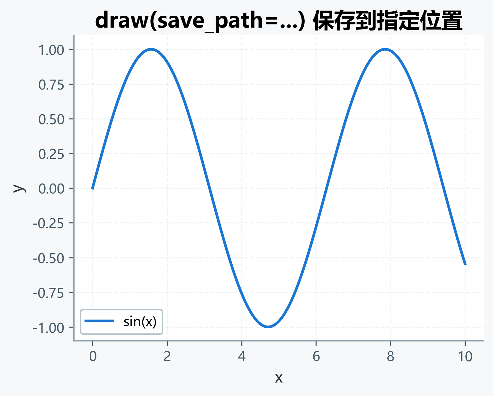

### 24.3 其他保存方式

保存为默认文件名 `MultiPlotter.png`（放在 `save_path_name` 指定的目录，默认“分析结果”）：

~~~python
plotter.draw(show=False, save=True)

plotter.draw(show=False, save=True, save_path_name="results")
~~~

### 24.4 清空配置与生命周期

如果要在同一个 `MultiPlotter` 对象上重新画一组图，先清空：

~~~python
plotter.clear()
~~~

`clear()` 会清空图层配置、坐标轴记录与范围记录，但**默认不关闭画布**
（与旧行为一致）。需要回收资源时：

~~~python
plotter.clear(close_figures=True)   # 清空配置，并关闭 draw() 产生的 Figure
plotter.close()                     # 只关闭画布，保留图层配置
~~~

多次 `draw()` 时旧 Figure **不会自动关闭**（避免破坏“同时保留多张图对比”的用法）。
长期运行、循环出图时请显式回收：

~~~python
plotter.draw(show=False, close_previous=True)   # 出图前先关掉上一次的 Figure
~~~

也可以让对象自己管生命周期：

~~~python
with MultiPlotter(ncols=2) as plotter:
    plotter.add_plot(kind="line", x=x, y=y)
    plotter.draw(show=False, save_path="results/a.png")
# 离开 with 时自动 close()
~~~

完整生命周期对照：

| 方法 | 图层配置 | Figure / Axes | 动画状态 |
| --- | --- | --- | --- |
| `draw()` | 保留 | 新建并记录 | — |
| `draw(close_previous=True)` | 保留 | 先关闭旧的，再新建 | — |
| `clear()` | **清空** | 保留（仍可 `close()`） | `AnimationPlotter` 会先 `stop_animation()` |
| `clear(close_figures=True)` | **清空** | **关闭** | 同上 |
| `close()` | 保留 | **关闭** | `AnimationPlotter` 会先 `stop_animation()` |
| `stop_animation()` | 保留 | 保留 | **停止并清空** |
| `with` 退出 | 保留 | **关闭** | — |

### 24.5 draw() 参数总览

| 参数 | 默认值 | 说明 |
| --- | --- | --- |
| `show` | `True` | 是否调用 `plt.show()` |
| `save` | `False` | 是否保存到 `save_path_name` 目录，文件名为 `MultiPlotter.png` |
| `save_path` | `None` | 保存到指定文件或目录，优先于 `save` |
| `save_path_name` | `"分析结果"` | `save=True` 时使用的目录 |
| `theme` | `None` | 本次绘制使用的主题：名称 / `Theme` / rcParams 字典；`None` 用对象自己的主题 |
| `style_scope` | `"context"` | `"context"` 临时应用主题并自动恢复；`"global"` 直接写全局 `plt.rcParams`（旧行为） |
| `close_previous` | `False` | 出图前是否先关闭上一次 `draw()` 产生的 Figure |

样式相关参数的详细说明见[第 2 章](#2-matplotlib-初始化设置)。

### 24.6 get_axes() 与手动微调

`draw()` 之后可以取回坐标轴做最后的调整：

~~~python
fig, axes = plotter.draw(show=False)

ax = plotter.get_axes(0)        # 按 subplot 序号取
ax.set_ylim(-2, 2)
ax.axhline(0, color="gray", linewidth=0.8, linestyle=":")

fig.savefig("results/tweaked.png")   # 手动保存也用 fig，不用 plt
~~~

---

## 26. 完整示例

~~~python
import numpy as np

from Multiplotter import MultiPlotter

def surface_function(x, y):
    return 0.5 * x**2 + 2.0 * y**2

x = np.linspace(-3, 3, 240)
y = np.linspace(-3, 3, 240)
X, Y = np.meshgrid(x, y)
Z = surface_function(X, Y)

# 示例下降轨迹
path_x = 2.5 * (1 - np.linspace(0, 1, 25)) ** 2
path_y = 2.0 * (1 - np.linspace(0, 1, 25)) ** 3
path_z = surface_function(path_x, path_y)

plotter = MultiPlotter(
    ncols=2,
    figsize_per_plot=(7, 5),
    dpi=130,
)

# 左图：三维曲面 + 下降轨迹 + 起止点
plotter.add_surface(
    X, Y, Z,
    subplot=0,
    title="三维曲面",
    xlabel="x", ylabel="y", zlabel="f(x, y)",
    cmap="turbo",
    edgecolor="none",
    light_enhance=True,
    colorbar=True,
    colorbar_kwargs={"shrink": 0.7, "pad": 0.1, "label": "f(x, y)"},
    view={"elev": 35, "azim": -55, "box_aspect": (1, 1, 0.8)},
)

plotter.add_line3d(
    path_x, path_y, path_z,
    subplot=0,
    color="crimson",
    linewidth=2.5,
    marker="o",
    markersize=4,
    label="gradient descent",
    legend=True,
    legend_kwargs={"loc": "upper left", "bbox_to_anchor": (1.03, 1.0)},
)

plotter.add_scatter3d(
    path_x[0], path_y[0], path_z[0],
    subplot=0,
    color="limegreen", s=90, marker="o", depthshade=False,
    label="start", legend=True,
)

plotter.add_scatter3d(
    path_x[-1], path_y[-1], path_z[-1],
    subplot=0,
    color="black", s=110, marker="*", depthshade=False,
    label="end", legend=True,
)

# 右图：二维等高线 + 下降轨迹
plotter.add_contour(
    X, Y, Z,
    subplot=1,
    title="二维等高线",
    xlabel="x", ylabel="y",
    levels=30,
    line_levels=15,
    cmap="viridis",
    contour_kwargs={"colors": "black", "linewidths": 0.5, "alpha": 0.65},
    clabel=True,
    colorbar=True,
    colorbar_kwargs={"shrink": 0.85, "aspect": 20, "label": "f(x, y)"},
    view={"aspect": "equal", "grid": True},
)

plotter.add_plot(
    kind="line", x=path_x, y=path_y, subplot=1,
    color="crimson", linewidth=2.2, marker="o", markersize=4,
    label="gradient descent", legend=True, zorder=5,
)

plotter.add_plot(
    kind="scatter", x=path_x[0], y=path_y[0], subplot=1,
    color="limegreen", s=90, marker="o",
    label="start", legend=True, zorder=6,
)

plotter.add_plot(
    kind="scatter", x=path_x[-1], y=path_y[-1], subplot=1,
    color="black", s=110, marker="*",
    label="end", legend=True, zorder=6,
)

fig, axes = plotter.draw(show=True, save=False)

# 也可以直接保存：
# plotter.draw(show=False, save_path="results/optimization_plot.png")
~~~

上面的完整示例运行后会生成一个包含三维曲面和二维等高线的窗口：左图是三维曲面、
下降轨迹、起点和终点；右图是填充等高线、等高线标签和二维下降轨迹。

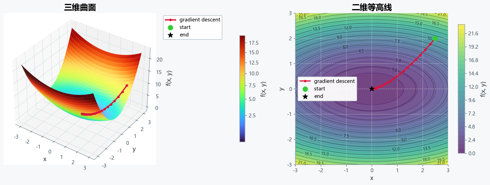

---

## 27. 各类图层总览

### 27.1 二维图层

下图的六个子图分别对应 `line`、`scatter`、`bar`（开启柱顶数值）、`hist`、
`heatmap` 和 `image`；`contour` 见[第 11 节](#11-二维等高线add_contour)，
`pie` 见[第 8 节](#8-二维饼图add_pie)。

### 27.2 三维图层

下图的左子图是 `surface + line3d + scatter3d` 混排，右子图是 `bar3d`；
`hist3d` 见[第 16 节](#16-三维直方图add_hist3d)。

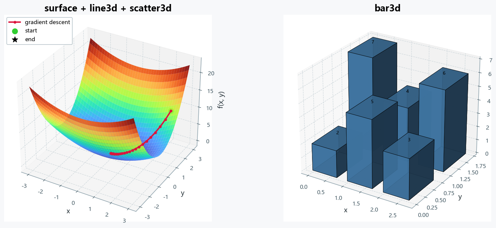

### 27.3 动画示例

动图由 `tests/generate_animation_examples.py` 生成，算法与 22.8、22.9 两节的代码一致：

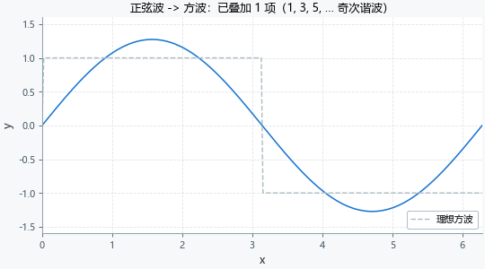

---

---

## 附录 A. 科研组合接口（实验性 API）

> 这一部分是**实验性 API**，接口可能随版本调整。
> 它不引入新的绘图逻辑，只是把已有的 `add_*` / `draw()` / `animate()`
> 按科研流程组合起来，所以随时可以退回直接使用 `MultiPlotter`。

科研绘图的典型流程是「算一遍 -> 画很多张图」：同一份计算结果要出
场分布、剖面曲线、指标表格，还要能逐帧播放。`multiplotter.science`
提供三个东西：

| 名字 | 作用 |
| --- | --- |
| `ScienceResult` | 算法输出的容器：`fields` + `scalars` + `frames` + `metadata` |
| `SciencePlotter` | 语义化绘图：`plot_field` / `plot_profile` / `plot_series` / `plot_table` / `plot_frames` |
| `convective_heat_transfer()` | 内置的对流传热算例，返回 `ScienceResult` |

### A.1 ScienceResult

~~~python
from multiplotter import ScienceResult

result = ScienceResult(
    name="实验 A",
    fields={"T": T, "u": u, "v": v},      # 命名数组
    scalars={"Nu": 4.52, "Ra": 1e5},      # 命名标量指标
    frames={0: T0, 10: T1},               # 动画帧（字典或序列）
    metadata={"x": x, "y": y},            # 网格与参数
)

print(result)               # ScienceResult(name='实验 A', fields=['T','u','v'], ...)
print(result.summary())     # 实验 A, Nu=4.52, Ra=1e+05
print(result.field("T").shape)
print(result.scalar("Nu"))
print(result.grid())        # (x, y)，从 metadata 里取
~~~

### A.2 SciencePlotter

~~~python
from multiplotter import SciencePlotter

painter = SciencePlotter(result, ncols=2, dpi=110)

painter.plot_field("T", subplot=0, kind="contour", cmap="inferno", colorbar=True)
painter.plot_field("u", subplot=1, kind="heatmap")
painter.plot_profile("T", subplot=2, axis="x", index=None)
painter.plot_series(subplot=3)
painter.plot_table(subplot=4)

fig, axes = painter.draw(show=False, save_path="results/paper.png")
~~~

| 方法 | 说明 |
| --- | --- |
| `plot_field(key, kind=...)` | 画二维场；`kind` 为 `"contour"`（默认）/ `"heatmap"` / `"surface"` |
| `plot_profile(key, axis="y", index=None)` | 沿某条线取剖面画折线；`index=None` 取中间 |
| `plot_series()` | 把 `scalars` 画成柱状图 |
| `plot_table()` | 把 `scalars` 画成表格 |
| `plot_frames(key, ...)` | 播放 `frames`（需要 `animate=True`） |

`SciencePlotter` 通过 `__getattr__` 转发到内部的 `MultiPlotter`，
所以 `painter.add_layer(...)` / `painter.get_axes(0)` 这些写法都能用。

### A.3 对流传热算例

~~~python
from multiplotter import SciencePlotter, convective_heat_transfer

result = convective_heat_transfer(ra=1e4, pr=0.71, n=64, steps=400)

print(result.scalar("Nu"))       # 平均努塞尔数
print(result.scalar("Nu_mid"))   # 中段平均（避开端点差分误差）
print(result.field("T").shape)   # (64, 64)

painter = SciencePlotter(result, ncols=2, dpi=110)
painter.plot_field("T", subplot=0, cmap="inferno", colorbar=True)
painter.plot_field("speed", subplot=1, kind="heatmap", cmap="viridis")
painter.draw(show=False)
~~~

参数：

| 参数 | 默认 | 说明 |
| --- | --- | --- |
| `ra` | `1e5` | 瑞利数（`1e3` ~ `1e6` 比较稳） |
| `pr` | `0.71` | 普朗特数（空气约 0.71） |
| `n` | `64` | 网格点数（`n x n`，至少 8） |
| `steps` | `400` | 时间步数 |
| `dt` | `None` | 时间步长，默认按网格与 `Ra` 自动选取 |
| `hot` / `cold` | `1.0` / `0.0` | 左右壁面的无量纲温度 |
| `record_every` | `0` | 每隔多少步记录一帧温度场；`0` 表示不记录 |
| `seed` | `0` | 初始扰动的随机种子 |

`fields` 包含 `T`、`u`、`v`、`omega`、`psi`、`speed`；
`scalars` 包含 `Ra`、`Pr`、`Nu`、`Nu_mid`、`T_mean`、`max_speed`、`dt`、`steps`。

> 这个算例的目的是演示**接口**，不是提供经过验证的 CFD 求解器：
> 它用显式时间推进 + Jacobi 迭代解压力（流函数）方程，
> 精度和稳定性只适合做演示。真实计算请换成自己的求解器，
> 只要返回一个 `ScienceResult` 就能复用全部绘图能力。
