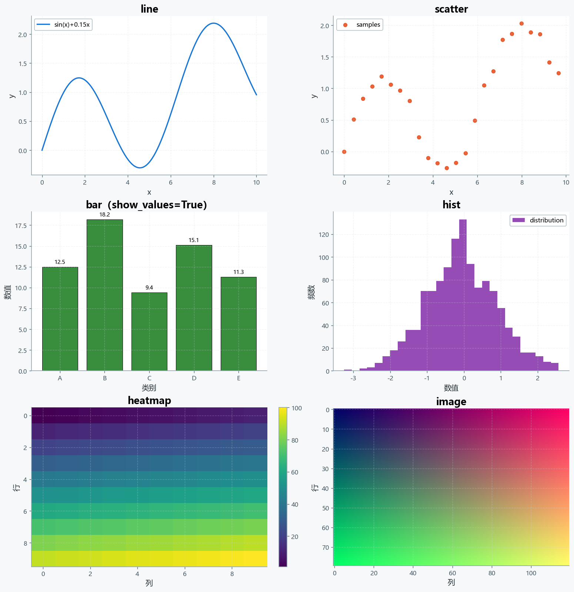
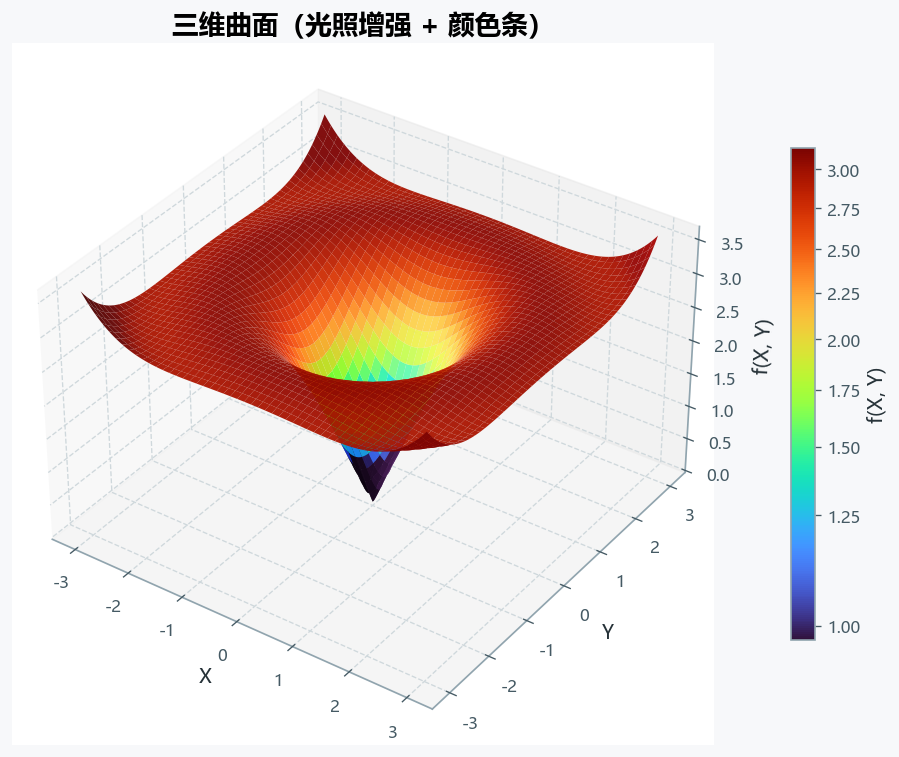
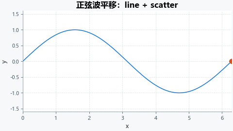

# MultiPlotter

一个统一的**二维 / 三维科研绘图**包：写一次初始化设置，之后只给数据。

~~~python
from multiplotter import MultiPlotter
import numpy as np

x = np.linspace(0, 2 * np.pi, 200)

plotter = MultiPlotter(ncols=2, figsize_per_plot=(6, 4), dpi=120)

plotter.add_plot(kind="line", x=x, y=np.sin(x), subplot=0,
                 title="正弦波", xlabel="x", ylabel="y",
                 color="#1976D2", label="sin(x)", legend=True)

plotter.add_surface(x, x, np.sin(x)[:, None] * np.cos(x)[None, :],
                    subplot=1, title="曲面", cmap="turbo")

fig, axes = plotter.draw(show=False, save_path="results/demo.png")
~~~

支持 19 种图层：

| 维度 | kind |
| --- | --- |
| 二维 | `line`、`scatter`、`bar`、`hist`、`pie`、`heatmap`、`image`、`contour`、`quiver`、`streamplot`、`table` |
| 三维 | `surface`、`line3d`、`scatter3d`、`bar3d`、`hist3d`、`quiver3d`、`stream3d` |
| 动画 | `AnimationPlotter`，见 [ANIMATION.md](ANIMATION.md) |

所有图层都先以配置（config）的形式登记到 `plot_configs`，调用 `draw()` 时才按添加顺序依次绘制。

## 目录

- [1. 安装](#1-安装)
- [2. 最小二维示例](#2-最小二维示例)
- [3. 最小三维示例](#3-最小三维示例)
- [4. 最小动画示例](#4-最小动画示例)
- [5. 科研算例：对流传热](#5-科研算例对流传热)
- [6. 只写初始化设置：init()](#6-只写初始化设置init)
- [7. 样式、主题与作用域](#7-样式主题与作用域)
- [8. 文档地图](#8-文档地图)
- [9. 依赖](#9-依赖)

---

## 1. 安装

~~~bash
# 方式一：从源码目录安装（推荐，可编辑安装）
pip install -e .

# 方式二：只装运行依赖
pip install -r requirements.txt

# 方式三：手动装
pip install numpy matplotlib
~~~

动画保存 `.gif` 需要 Pillow，`.mp4` 需要 ffmpeg：

~~~bash
pip install pillow
# ffmpeg 从 https://ffmpeg.org 下载后加入 PATH
~~~

依赖的完整说明（含版本范围与可选依赖）见 [pyproject.toml](pyproject.toml) 与本文第 9 章。

## 2. 最小二维示例

~~~python
import numpy as np
from multiplotter import MultiPlotter

x = np.linspace(0, 2 * np.pi, 200)

plotter = MultiPlotter(ncols=1, figsize_per_plot=(7, 4), dpi=120)

plotter.add_plot(
    kind="line",
    x=x,
    y=np.sin(x),
    subplot=0,
    title="最小二维示例",
    xlabel="x",
    ylabel="y",
    color="#1976D2",
    linewidth=2.0,
    label="sin(x)",
    legend=True,
    view={"xlim": (0, 2 * np.pi), "ylim": (-1.5, 1.5)},
)

fig, axes = plotter.draw(show=False, save_path="results/line.png")
~~~

## 3. 最小三维示例

~~~python
import numpy as np
from multiplotter import MultiPlotter

x = np.linspace(-3, 3, 80)
X, Y = np.meshgrid(x, x)
Z = np.sin(np.sqrt(X ** 2 + Y ** 2))

plotter = MultiPlotter(ncols=1, figsize_per_plot=(7, 5), dpi=120)

plotter.add_surface(
    X, Y, Z,
    subplot=0,
    title="最小三维示例",
    cmap="turbo",
    light_enhance=True,
    colorbar=True,
    view={"elev": 30, "azim": -60},
)

fig, axes = plotter.draw(show=False, save_path="results/surface.png")
~~~

> **二维和三维不能放在同一个 subplot**。混排时请分到不同 subplot，
> 例如 `subplot=0` 放 `surface`，`subplot=1` 放 `contour`。

## 4. 最小动画示例

~~~python
import numpy as np
from multiplotter import AnimationPlotter

x = np.linspace(0, 2 * np.pi, 200)

plotter = AnimationPlotter(ncols=1, figsize_per_plot=(7, 4), dpi=100)

plotter.add_plot(
    kind="line", x=x, y=np.sin(x), subplot=0,
    title="正弦波平移", xlabel="x", ylabel="y",
    # 动画必须固定坐标轴范围，否则每帧会自动缩放，画面抖动
    view={"xlim": (0, 2 * np.pi), "ylim": (-1.5, 1.5)},
)

plotter.draw(show=False)                      # 先出静态底图

plotter.animate(
    frames=60,
    update_func=lambda frame: {"y": np.sin(x - frame / 20 * np.pi)},
    interval=40,
    save=True,
    save_path="results/sine.gif",
)
~~~

完整参数（三种更新模式、`frame_data`、blit、保存格式）见 [ANIMATION.md](ANIMATION.md)。

## 5. 科研算例：对流传热

包内置了一个**刻意保持简单**的二维方腔自然对流（对流传热）算例，
用来演示「科学计算 -> 组合绘图」的完整流程。

控制方程（无量纲、Boussinesq 近似）：

~~~text
∂T/∂t + u·∇T = (1/√(Ra·Pr)) ∇²T          温度：对流 + 扩散
∇²ψ = -ω                                  流函数—涡量
u = ∂ψ/∂y,  v = -∂ψ/∂x
∂ω/∂t + u·∇ω = √(Pr/Ra) ∇²ω + ∂T/∂x      涡量：对流 + 扩散 + 浮力
~~~

边界条件：左右壁面分别是热壁 / 冷壁，上下壁面绝热，四壁无滑移
（壁面涡量用 Thom 条件，不是简单取 0）。

算法与绘图的分离方式是：**算法只返回数据，绘图只消费数据**。

~~~python
from multiplotter import SciencePlotter, convective_heat_transfer

# ---- 1. 算法：只算，不画 ----
result = convective_heat_transfer(
    ra=1e4,          # 瑞利数
    pr=0.71,         # 普朗特数（空气）
    n=41,            # 网格 41 x 41
    steps=1200,      # 时间步数（不足会停在未发展的流场上）
    record_every=40, # 每 40 步记录一帧，供动画使用
)

print(result.summary())
# 自然对流 Ra=1e+04, ..., Nu=2.27, Nu_mid=2.44, ...

# ---- 2. 绘图：只画，不算 ----
painter = SciencePlotter(result, ncols=2, dpi=110)

painter.plot_field("T", subplot=0, cmap="inferno", colorbar=True)
painter.plot_field("speed", subplot=1, kind="heatmap", cmap="viridis")
painter.plot_profile("T", subplot=2, axis="x")
painter.plot_table(subplot=3)

fig, axes = painter.draw(show=False, save_path="results/convection.png")
~~~

算出来的温度场、流线和速度场：

~~~python
from multiplotter import MultiPlotter

# 也可以不用 SciencePlotter，直接组合各种 add_* —— 二者完全等价
plotter = MultiPlotter(ncols=2, figsize_per_plot=(6, 5), dpi=110)
x, y = result.metadata["x"], result.metadata["y"]

plotter.add_contour(x, y, result.field("T"), subplot=0,
                    title="温度场", cmap="inferno", colorbar=True,
                    view={"aspect": "equal", "grid": False})
plotter.add_streamplot(x, y, result.field("u"), result.field("v"), subplot=1,
                       title="流线 + 速度大小", cmap="turbo", colorbar=True,
                       view={"aspect": "equal", "grid": False})
plotter.draw(show=False, save_path="results/convection_fields.png")
~~~

逐帧播放温度场的演化（需要 `animate=True`）：

~~~python
painter = SciencePlotter(result, ncols=1, dpi=90, animate=True)
painter.plot_frames("T", subplot=0, kind="contour", cmap="inferno",
                    animate_kwargs={"fps": 12})
~~~

可运行脚本见 [`examples/02_convective_heat_transfer.py`](examples/02_convective_heat_transfer.py)
与 [`examples/05_science_composition.py`](examples/05_science_composition.py)。

> 这个算例的目的是演示**接口**：它用显式时间推进 + Jacobi 迭代求解，
> 在 Ra = 10³ ~ 10⁵ 范围内平均努塞尔数与经典基准
> de Vahl Davis (1983) 相差约 1% ~ 2%，
> 因此可以作为「算法产出 -> 组合绘图」的可靠示例。
> 但它**不是**通用 CFD 求解器：网格是均匀的、时间推进是显式的、
> 泊松求解器是 Jacobi 迭代，没有做网格收敛性与高 Ra 稳定性验证。
> 真实计算请换成你自己的求解器，只要返回一个 `ScienceResult` 即可复用全部绘图能力。

## 6. 只写初始化设置：init()

如果一批图共用同样的标题、坐标轴标签、图例、网格、字体，用 `init()` 只写一次：

~~~python
from multiplotter import MultiPlotter

plotter = MultiPlotter.init(
    ncols=2, dpi=120,
    title="实验结果",
    xlabel="x", ylabel="y",
    legend=True,
    grid=True,
    cmap="turbo",
    xlim=(0, 10), ylim=(-2, 2),
)

plotter.add("line", {"x": x, "y": y1})           # 只给 kind + 数据
plotter.add("scatter", {"x": x, "y": y2})
plotter.add("bar", {"x": labels, "y": values})

fig, axes = plotter.draw(show=False)
~~~

优先级（从低到高）：

~~~text
KIND_DEFAULTS  <  init() 的全局样式  <  add() 的参数  <  add() 的 **kwargs
~~~

每个 kind 都有一套预设（`surface` 默认开光照增强、`bar` 默认标数值…），
完整列表和参数说明见 [API.md 第 3 章](API.md#3-init-快速绘图只写初始化设置)。

## 7. 样式、主题与作用域

`draw()` **默认不修改全局 `plt.rcParams`**：主题通过
`matplotlib.rc_context()` 临时生效，画完自动恢复。

~~~python
import matplotlib.pyplot as plt
from multiplotter import MultiPlotter

plt.rcParams["axes.titlesize"] = 30          # 你自己的设置
plt.rcParams["axes.grid"] = False

plotter = MultiPlotter(ncols=1)
plotter.add_plot(kind="line", x=x, y=y)
plotter.draw(show=False)

print(plt.rcParams["axes.titlesize"])        # 仍然是 30，没有被覆盖
print(plt.rcParams["axes.grid"])             # 仍然是 False
~~~

主题是**实例级**配置，多个 `MultiPlotter` 对象互不影响：

~~~python
light = MultiPlotter(ncols=1)                        # 默认浅色
dark = MultiPlotter(ncols=1, theme="surface")        # 深色坐标轴面板
custom = MultiPlotter(ncols=1, theme={"axes.grid": False,
                                      "figure.facecolor": "#FFFFFF"})

plotter.draw(show=False, theme="surface")            # 也可以只在某次绘制时指定
~~~

需要沿用旧行为（直接写全局 `plt.rcParams`）时显式声明：

~~~python
plotter.draw(show=False, style_scope="global")
~~~

保存统一走 `fig.savefig()`，不使用 `plt.savefig()`，
因此同时存在多个 Figure 时不会存错图。

生命周期：

~~~python
plotter.draw(show=False, close_previous=True)   # 出图前先关掉上一次的 Figure
plotter.close()                                 # 关闭画布，保留图层配置
plotter.clear()                                 # 清空图层配置
plotter.clear(close_figures=True)               # 清空配置并关闭画布

with MultiPlotter(ncols=2) as plotter:          # 离开 with 时自动 close()
    plotter.add_plot(kind="line", x=x, y=y)
    plotter.draw(show=False)
~~~

细节见 [EXTENDING.md 的样式作用域一节](EXTENDING.md#132-样式作用域context-与-global)。

## 8. 文档地图

| 文档 | 内容 |
| --- | --- |
| [API.md](API.md) | 所有方法与参数的完整参考（第 1 ~ 27 章） |
| [ANIMATION.md](ANIMATION.md) | `AnimationPlotter`：更新模式、`frame_data`、保存 |
| [EXTENDING.md](EXTENDING.md) | 包结构、图层契约、`register_layer()`、新增图层实战 |
| [FAQ.md](FAQ.md) | 报错与常见现象排查 |
| [`examples/`](examples/) | 可直接运行的脚本与图片路径说明 |

给二次开发者的一句话版本：

~~~python
from multiplotter import MultiPlotter

def draw_step(ax, config):
    ax.step(config["x"], config["y"], where=config["where"])

MultiPlotter.register_layer(
    kind="step", dimension=2, add_method="add_step",
    draw_handler=draw_step, defaults={"linewidth": 2.2},
    passthrough={"where"},
)
~~~

注册一次，`add_layer()`、`init()`、`PlotBuilder`、`draw()` 就都能用了 ——
不用再改七个地方。详见 [EXTENDING.md](EXTENDING.md)。

## 9. 依赖

运行依赖（`pyproject.toml` 里的 `dependencies`）：

| 包 | 版本范围 | 用途 |
| --- | --- | --- |
| `numpy` | `>=1.21` | 数据容器与数值计算 |
| `matplotlib` | `>=3.5` | 全部绘图后端 |

可选依赖：

| 包 | 用途 | 安装 |
| --- | --- | --- |
| `pillow` | 保存 `.gif` 动画 | `pip install "multiplotter[gif]"` |
| `pandas` | 传入 DataFrame 作为表格数据 | `pip install "multiplotter[pandas]"` |
| `jax` / `jaxlib` | 用 JAX 生成数据 | `pip install "multiplotter[jax]"` |

开发依赖（测试与文档）：

~~~bash
pip install -e ".[dev]"
~~~

matplotlib 3.5 以下不支持 `streamplot(broken_streamlines=...)` 等新参数，
此时框架会自动忽略并给出提示；版本兼容策略集中在 `multiplotter/compat.py`。

### 中文字体

主题会自动选择系统中真实存在的中文字体，候选顺序为：

~~~text
Microsoft YaHei
SimHei
Noto Sans CJK SC
Noto Sans SC
WenQuanYi Zen Hei
Noto Sans CJK TC
Arial Unicode MS
~~~

Windows 通常可用 Microsoft YaHei 或 SimHei。Ubuntu/WSL 若没有中文字体：

~~~bash
sudo apt update
sudo apt install fonts-noto-cjk
~~~

安装后重启 Python / Jupyter kernel。中文字体不是 Python 包，
需要在操作系统层面安装。

### 重新生成示例图片与动图

~~~bash
python tests/generate_examples.py             # 静态示例图片
python tests/generate_animation_examples.py   # 动画示例动图
python tests/generate_compare_examples.py     # 开篇对比章节的图与动图
python tests/generate_field_examples.py       # 矢量场 / 张量场 / 表格的图与动图
python tests/extend_example.py                # 扩展开发示例（step / trisurf）
python tests/library_smoke_test.py            # 全部 add_* 示例的冒烟测试
python tests/init_test.py                     # init() / PlotBuilder 测试
python tests/field_table_test.py              # 矢量场与表格测试
python tests/extension_test.py                # 扩展开发测试
python tests/anim_api_test.py                 # AnimationPlotter 测试
python tests/compat_test.py                   # Matplotlib 版本兼容层测试
python tests/defaults_test.py                 # 图层契约、预设可达性、默认值快照
python tests/contract_test.py                 # 绘图契约回归（对比 contract_baseline.json）
python tests/readme_check.py                  # 校验文档图片路径、锚点、编号、表格
~~~

两个快照文件是**长期回归资产**，改了默认值或绘图行为就要同步更新：

~~~bash
python tests/defaults_test.py --update-snapshot   # 更新默认值快照
python tests/contract_test.py --update            # 更新绘图契约基线
~~~

图片文件名带顺序编号。新增图片后跑一次
`python tests/renumber_images.py --apply`，它会更新文档与生成脚本里的引用；
编号是**稳定**的（已有编号不变，新图取最小空号），所以不会让已有图片改名。

---

**版本兼容与 API 稳定性**见 [EXTENDING.md 第 17 章](EXTENDING.md#17-api-稳定性与版本兼容)：
哪些是公开 API、哪些是扩展 API、哪些是内部实现。
